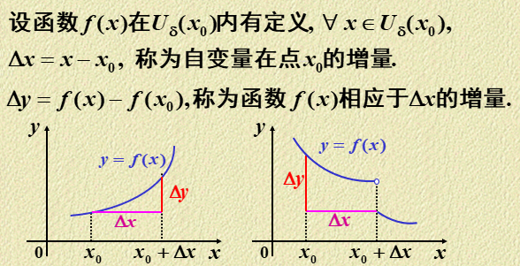
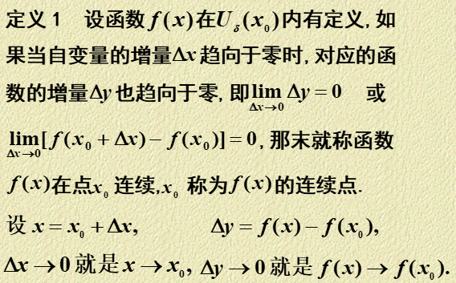
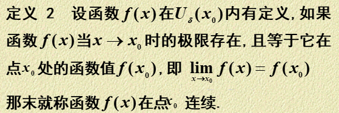
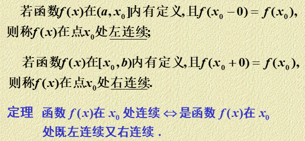
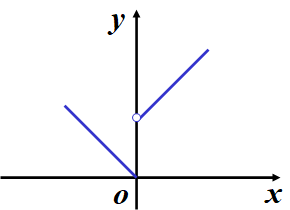
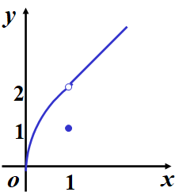
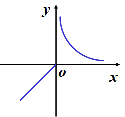
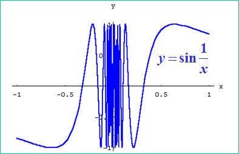
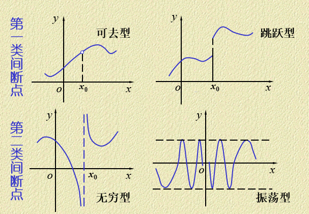

1-8 1-9 2-2 2-3 2-4 2-5 2-6 2-7

# 高等数学

1. 隐函数，复合函数，参数函数求导
2. 高阶导数求n次导数
3. 微分运算
4. 间断点
5. 无穷小量的比较

## 函数的连续性和间断点

### 函数的连续性

#### 函数的增量

#### 函数连续

#### 单侧连续

#### 连续函数与连续区间

在区间上每一点都连续的函数,叫做在该区间上的连续函数,或者说函数在该区间上连续.

连续函数的图形是一条连续而不间断的曲线.

### 函数的间断点

函数$f(x)$在点x0处连续必须满足的三个条件：

1. f(x)在x0处有定义
2. $\lim_{x \to x_0} f(x)$存在
3. $\lim_{x \to x_0} f(x)=f(x_0)$

上述条件之一不满足则称x0为函数的间断点

#### 跳跃间断点

若$f(x)$在x0处左右极限都存在但$f(x_0-0) \neq f(x_0 +0)$则称x0为函数$f(x)$的跳跃间断点

#### 可去间断点

若$f(x)$在x0处极限存在，但$\lim_{x \to x_0} f(x)=A \neq f(x_0)$或在x0处无定义，则称x0为函数的可去间断点

跳跃间断点与可去间断点统称为第一类间断点

第一类间断点的左右极限都存在

#### 第二类间断点

若$f(x)$在x0处左右极限至少有一个不存在，则称点$x_0$为函数的第二类间断点

无穷间断点

震荡间断点

狄利克雷函数

## 无穷小量的比较

### 无穷小

极限为零的变量称为无穷小

对于给定正数$\epsilon$，总存在正数$\delta(X)$使得对于符合不等式$0<|x-x_0|<\delta(|x|>X)$的一切x对应的函数值都满足不等式$|f(x)| \lt \epsilon$，则称函数$f(x)$当$x \to x_0$时为无穷小

$$
\lim_{x \to x_0} f(x)=0 / \lim_{x \to \infin}f(x)=0
$$

无穷小是变量,不能与很小的数混淆

零是可以作为无穷小的唯一的数

无穷小和函数极限的关系

$$
\lim_{x\to x_0}f(x)=A\Leftrightarrow f(x)=A+\alpha(x)
$$

$\alpha(x)$是$x \to x_0$时的无穷小

* 在同一过程中,有限个无穷小的代数和仍是无穷小
* 有界函数与无穷小的乘积是无穷小
* 在同一过程中,有极限的变量与无穷小的乘积是无穷小
* 常数与无穷小的乘积是无穷小
* 有限个无穷小的乘积也是无穷小

### 无穷小量的比较

当$x \to x_0$，$x,x^2,\sin x, x^2 \sin \frac{1}{x}$都是无穷小

两两相除求极限得到不同的值，反映了趋向于零的“快慢”程度不同

设$\alpha,\beta$是同意过程中的两个无穷小，且$\alpha \neq 0$

* $\lim \frac{\beta}{\alpha}=0$就说$\beta$是比$\alpha$高阶的无穷小，记作$\beta=o(\alpha)$
* $\lim \frac{\beta}{\alpha}=C$则$\beta$和$\alpha$是同阶无穷小，如果$C=1$则$\beta$和$\alpha$是等价无穷小记为$\alpha \sim \beta$
* $\lim \frac{\beta}{\alpha ^ k}=C(C \neq 0,k>0)$，则$\beta$是$\alpha$的k阶无穷小

一般比较无穷小量的时候，我们都是采用比值求极限的方法，这里面还有可能涉及到等价无穷小替换

### 等价无穷小替换

$$
x \to 0,\sin x/\arcsin x/\tan x/\arctan x/ \ln(x+1)/e^x-1 \sim x
$$

$$
1-\cos x \sim \frac{1}{2} x^2
$$

等价无穷小可给出函数的近似表达式

$$
\lim \frac{\beta}{\alpha}=1,\lim \frac{\alpha-\beta}{\alpha}=0,\alpha-\beta=o(\alpha)
$$

等价的无穷小量之间可以进行替换

$$
\alpha \sim \alpha',\beta \sim \beta',\exist \lim \frac{\beta'}{\alpha'},\lim \frac{\beta}{\alpha}=\lim \frac{\beta'}{\alpha'}
$$

## 隐函数，复合函数，参数函数求导

### 简单的求导法则

$$
\begin{aligned}&[u(x)\pm v(x)]^{\prime}=u^{\prime}(x)\pm v^{\prime}(x);\\&[u(x)\cdot v(x)]^{\prime}=u^{\prime}(x)v(x)+u(x)v^{\prime}(x);\\&[\frac{u(x)}{v(x)}]^{\prime}=\frac{u^{\prime}(x)v(x)-u(x)v^{\prime}(x)}{v^{2}(x)}\quad(v(x)\neq0).\end{aligned}
$$

### 反函数求导

反函数的导数等于直接函数导数的倒数

若$x=\phi(y)$在某区间内单调、可导且$\phi '(y) \neq 0$，则若它的反函数$y=f(x)$在对应区间也可导，则有

$$
f'(x)=\frac{1}{\phi'(y)}
$$

### 复合函数的求导法则

因变量对自变量求导,等于因变量对中间变量求导,乘以中间变量对自变量求导.(链式法则)

设$y=f(u),u=\phi(v),v=\psi(x)$

$$
\frac{dy}{dx}=\frac{dy}{du}\cdot\frac{du}{dv}\cdot\frac{dv}{dx}
$$

### 隐函数求导

隐函数的显化
$$
F(x,y)=0 \Rightarrow y=f(x)
$$
隐函数不易显化或不能显化如何求导

隐函数求导法则:用复合函数求导法则直接对方程两边求导

### 对数求导法

先在方程两边取对数,  然后利用隐函数的求导方法求出导数.

适用多个函数相乘和幂指函数$u(x)^{v(x)}$

### 参数方程确定函数导数

$$
\begin{cases}x=\varphi(t)\\y=\psi(t)\end{cases}
$$

$$
\frac{dy}{dx}=\frac{dy}{dt}\cdot\frac{dt}{dx}=\frac{dy}{dt}\cdot\frac1{\frac{dx}{dt}}=\frac{\psi^{\prime}(t)}{\varphi^{\prime}(t)}
$$

## 高阶导数

### 高阶导数的定义

函数的一阶导可导，则一阶导数的导数是二阶导数

二阶导数的导数称为三阶导数

三阶导数的导数称为四阶导数

### 高阶导数的运算法则

莱布尼茨公式

$$
(u \cdot v)^{(n)}=\sum_{k=0}^n C_n^k u^{(n-k)}v^{(k)}
$$

## 微分运算

### 微分定义

微分$dy$是函数增量$\Delta y$的线性主部
$$
\Delta y-dy=o(\Delta x)
$$

### 可微的条件

充要条件是可导且上面的$A=f'(x_0)$，函数的微分$dy$与自变量的微分$dy$之商等于该函数的导数，导数也叫微商

### 微分的几何意义

### 微分的求法

$$
dy=f'(x)dx
$$

# 习题

## 无穷小的比较

当$x \to 0,4x\tan ^3 x$为x的四阶无穷小

$$
\lim_{x\to 0}\frac{\tan x-\sin x}{\sin^3 2x}
$$

## 间断点

$$
y=\frac{x^2-1}{x^2-3x+2}
$$

x=1是第几类间断点，x=2是第几类间断点

确定a，b的值，使$f(x)=\frac{e^x-b}{(x-a)(x-1)}$

1. 有无穷间断点x=0
2. 有可去间断点x=1

## 各种函数的求导

$$
y=x(\sin x)^{(\cos x)},y'?
$$

对数

$$
x=y^2+y,u=(x^2+x)^{\frac{3}{2}},\frac{dy}{du}
$$
参数函数+隐函数

$$
\begin{cases}x=t+e^t\\y=\sin t\end{cases},\left.\frac{d^2y}{dx^2}\right|_{t=0}=?
$$
复合函数+高阶导数

$$
y=\ln(\cos(10+3x^2)),y'?
$$
复合函数求导

## 高阶导数求法的举例

### 直接法

$$
y=\arctan x,f''(0)?f'''(0)?
$$

$$
y=\ln(1+x),y^{(n)}?
$$

$$
y=x^2e^{2x},y^{(20)}?
$$

### 间接法

$$
y=\frac{1}{x^2-1},y^{(5)}?
$$

$$
y=\sin^6 x+\cos^6x,y^{(n)}?
$$

