# Linux

## Linux命令

### 路径

#### 相对路径

以当前目录为起点描述路径，无需以/起手

#### 绝对路径

以根目录为起点描述路径，以/起手

#### 特殊路径符

`.`表示当前目录

`..`表示上一级目录

`~`表示home目录

### Linux命令基础

```shell
command [-options] [parameter]
```

命令本体 可选选项 可选参数

### ls命令

```shell
ls [-a -h -l] [path]
```

展示当前工作目录

默认加载home目录，home目录作为当前工作目录，ls命令列出home目录的内容

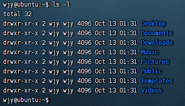

#### ls命令参数和选项

**参数**

参数就是你想要查看的路径，注意路径需要相对于当前工作路径或绝对路径

**选项**

-a all，列出全部文件（隐藏文件/文件夹）

-l list，以列表形式展示内容，展示更多信息

-h 显示文件大小单位

各选项可以组合使用

### cd命令

切换工作目录

```shell
cd [path]
```

cd默认回到home目录

### pwd命令

print work directory

查看当前所在命令，无选项/参数

```shell
pwd
```

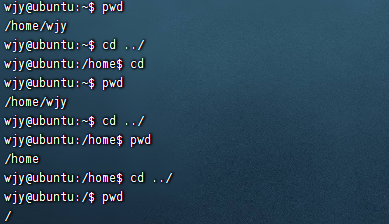

### mkdir命令

make directory

```shell
mkdir [-p] [path]
```

参数必填，表示创建文件夹的路径

-p表示自动创建不存在的父目录，适用于创建连续多层级的目录

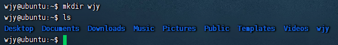

### touch命令

```shell
touch [path]
```

touch无选项，参数必填

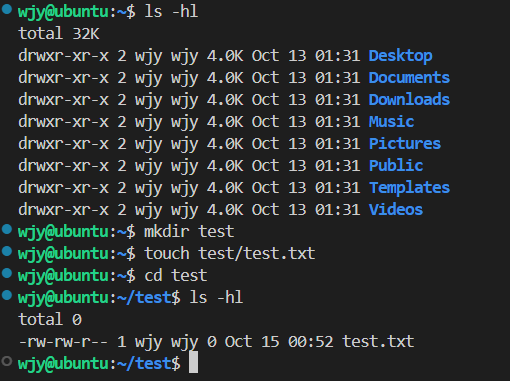

### cat命令

cat命令查看文件内容

```shell
cat [path]
```

无选项，参数必填，只读文件内容

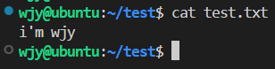

### more命令

more也可以查看文件内容

* cat直接显示文件内容
* more支持翻页，内容过多可以逐页展示，空格翻页，q退出查看

```shell
more [path]
```

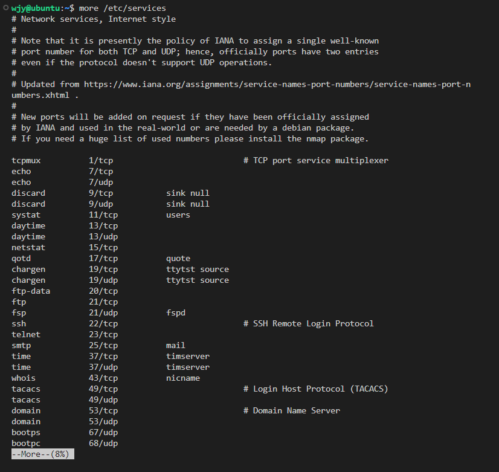

### cp命令

copy，用于复制文件（夹）

```shell
cp [-r] [p1] [p2]
```

* -r可选，用于递归复制文件夹
* p1表示被复制文件（夹）路径
* p2表示复制目的路径

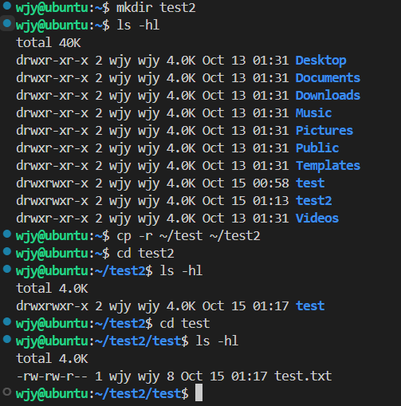

### mv命令

move，用于移动文件（夹）

```shell
mv [p1] [p2]
```

* p1表示被移动文件（夹）路径
* p2表示移动目的路径

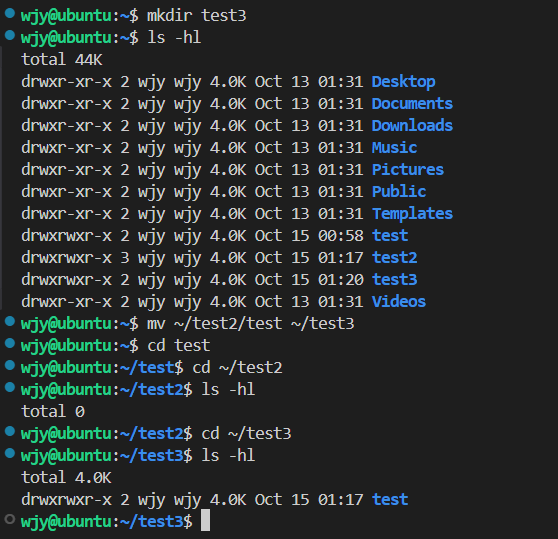

### rm命令

remove，用于删除文件（夹）

```shell
rm [-r -f] [p1 p2 p3 ... pn]
```

* -r用于递归删除文件夹，删除文件夹必须使用
* -f表示强制删除（force），不会弹出确认
* 多个参数表示要删除的文件（夹）路径，空格间隔开

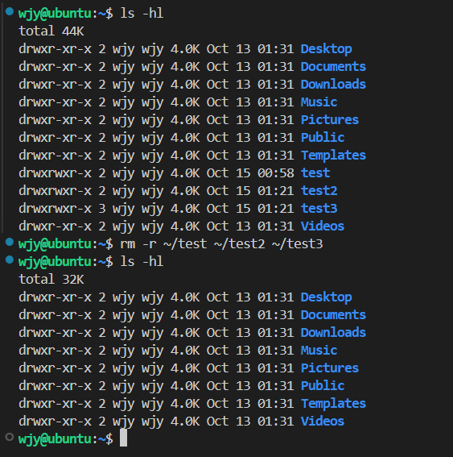

### which命令

which查看使用命令的程序文件存放在哪里

```shell
which [order]
```

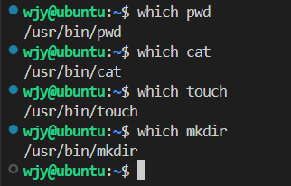

### find命令

find搜索指定的文件

```shell
find [p1] -name "n1"
```


#### 按照文件大小查找文件

```shell
find [p1] -size +|-n[KMG]
```

* `+`大于，`-`小于
* n表示大小数字
* kmg表示大小单位

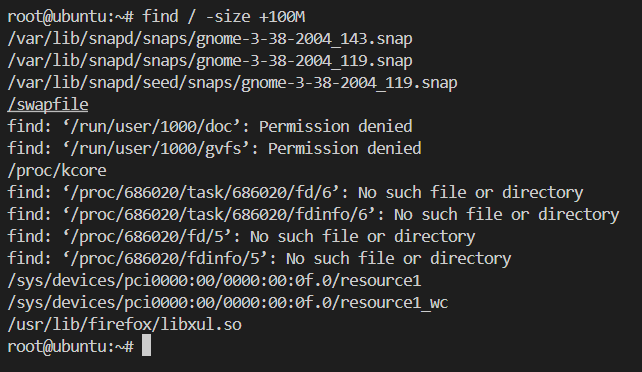

### grep命令

grep从文件中通过关键字过滤文件行

```shell
grep [-n] 关键字 [path]
```

* `-n`结果显示匹配行的行号
* 关键字必填，表示过滤的关键字，建议使用“”将关键字包围起来
* path表示要过滤内容的文件路径，作为内容输入端口

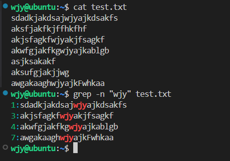

### wc命令

wc统计文件的行数、单词数量

```shell
wc [-c -m -l -w] [path]
```

* `-c`统计bytes数量
* `-m`统计文件行数、单词数量
* `-l`统计行数
* `-w`统计单词数量
* 文件路径作为内容输入端口

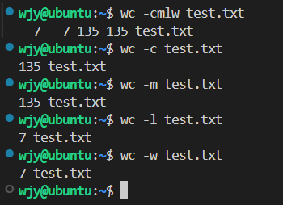

### |管道符

管道符：将管道符左边命令的结果作为右边命令的输入

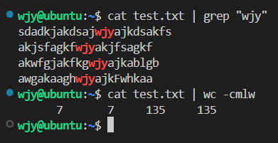

### 通配符

* `*`表示通配符，匹配任意内容（包含空），用于模糊匹配

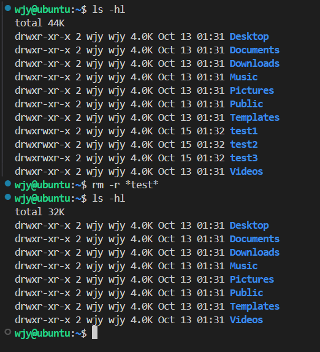

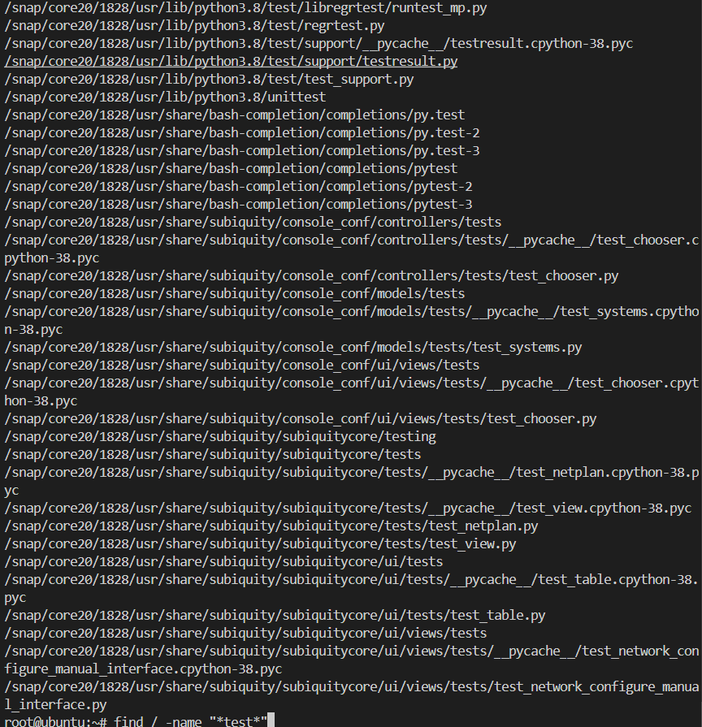
