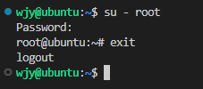

# Linux

## Linux用户和权限

### root

拥有最大权限的账户名 超级管理员

拥有最大的系统操作权限


### 用户、用户组


### 权限信息


* 第一列表示文件（夹）权限控制信息
* 第三列表示文件（夹）所属用户
* 第四列表示文件（夹）所属用户组


以 `drwxr-xr-x`为例

* d表示文件夹
* rwx表示所属用户权限
* r-x表示所属用户组权限，-表示无此权限
* r-x表示其他用户权限

r表示读，w表示写，x表示执行

针对文件、文件夹的不同，rwx有细微差别

* r

  * 文件：可以查看文件内容
  * 文件夹：可以查看文件夹内容，可ls
* w

  * 文件：可以修改文件内容
  * 文件夹：可以在文件夹内增删改
* x

  * 文件：将文件作为程序执行
  * 文件夹：可以更改工作目录到此文件夹，可cd


## Linux命令

### 路径

#### 相对路径

以当前目录为起点描述路径，无需以/起手

#### 绝对路径

以根目录为起点描述路径，以/起手

#### 特殊路径符

`.`表示当前目录

`..`表示上一级目录

`~`表示home目录

### Linux命令基础

```powershell
command [-options] [parameter]
```

命令本体 可选选项 可选参数

### ls命令

```powershell
ls [-a -h -l] [path]
```

展示当前工作目录

默认加载home目录，home目录作为当前工作目录，ls命令列出home目录的内容


#### ls命令参数和选项

**参数**

参数就是你想要查看的路径，注意路径需要相对于当前工作路径或绝对路径

**选项**

-a all，列出全部文件（隐藏文件/文件夹）

-l list，以列表形式展示内容，展示更多信息

-h 显示文件大小单位

各选项可以组合使用

### cd命令

切换工作目录

```powershell
cd [path]
```

cd默认回到home目录

### pwd命令

print work directory

查看当前所在命令，无选项/参数

```powershell
pwd
```


### mkdir命令

make directory

```powershell
mkdir [-p] [path]
```

参数必填，表示创建文件夹的路径

-p表示自动创建不存在的父目录，适用于创建连续多层级的目录


### touch命令

```powershell
touch [path]
```

touch无选项，参数必填


### cat命令

cat命令查看文件内容

```powershell
cat [path]
```

无选项，参数必填，只读文件内容


### more命令

more也可以查看文件内容

* cat直接显示文件内容
* more支持翻页，内容过多可以逐页展示，空格翻页，q退出查看

```powershell
more [path]
```


### cp命令

copy，用于复制文件（夹）

```powershell
cp [-r] [p1] [p2]
```

* -r可选，用于递归复制文件夹
* p1表示被复制文件（夹）路径
* p2表示复制目的路径


### mv命令

move，用于移动文件（夹）

```powershell
mv [p1] [p2]
```

* p1表示被移动文件（夹）路径
* p2表示移动目的路径


### rm命令

remove，用于删除文件（夹）

```powershell
rm [-r -f] [p1 p2 p3 ... pn]
```

* -r用于递归删除文件夹，删除文件夹必须使用
* -f表示强制删除（force），不会弹出确认
* 多个参数表示要删除的文件（夹）路径，空格间隔开


### which命令

which查看使用命令的程序文件存放在哪里

```powershell
which [order]
```


### find命令

find搜索指定的文件

```powershell
find [p1] -name "n1"
```


#### 按照文件大小查找文件

```powershell
find [p1] -size +|-n[KMG]
```

* `+`大于，`-`小于
* n表示大小数字
* kmg表示大小单位


### grep命令

grep从文件中通过关键字过滤文件行

```powershell
grep [-n] 关键字 [path]
```

* `-n`结果显示匹配行的行号
* 关键字必填，表示过滤的关键字，建议使用“”将关键字包围起来
* path表示要过滤内容的文件路径，作为内容输入端口


### wc命令

wc统计文件的行数、单词数量

```powershell
wc [-c -m -l -w] [path]
```

* `-c`统计bytes数量
* `-m`统计文件行数、单词数量
* `-l`统计行数
* `-w`统计单词数量
* 文件路径作为内容输入端口


### echo命令

echo在命令行内输出指定内容

```powershell
echo [content]
```

#### \`反引号

通过反引号将命令包围，被反引号包围的内容会被作为命令执行，而非普通字符

```powershell
echo pwd
echo `pwd`
```


#### 重定向符

`>`和 `>>`

* `>`：将左侧命令的结果**覆盖**写入符号右侧指定文件
* `>>`：将左侧命令的结果追加写入符号右侧指定文件

### tail命令

tail查看文件尾部内容，跟踪文件的最新修改

```powershell
tail [-f -num] [path]
```

* path表示被跟踪文件路径
* -f：表示持续跟踪
* -num查看尾部多少行，默认10行


### su命令

switch user，用于账户切换的系统命令

```powershell
su [-] [name]
```

* -可选，表示是否在切换用户后加载环境变量
* 参数表示要切换的用户名，省略表示切换到root
* 切换用户后，通过exit退回上一个用户



* 使用普通用户切换到其他用户需要输入密码
* 使用root用户切换到其他用户无需密码


### sudo命令

sudo授权普通命令，临时以root身份执行

```powershell
sudo [order]
```

* 在其他命令之前，带上sudo
* 需要为普通用户配置sudo认证

#### 配置sudo认证


### 用户组命令

* 创建用户组

  ```powershell
  groupadd [name]
  ```
* 删除用户组

  ```powershell
  groupdel [name]
  ```

### 修改权限控制命令

#### chmod命令

chmod修改文件（夹）权限信息

只有文件（夹）的所属用户或者root用户可以修改

```powershell
chmod [-R] u=...,g=...,o=... [path]
```

* `-R`对文件夹全部内容应用相同操作
* u表示用户权限，g表示用户组权限，o表示other其他用户权限


权限的数字序号，也就是二进制编码的方式用来标记用户权限，第一位数字表示用户权限，第二位数字表示用户组权限，第三位表示其他用户权限

以rwx的顺序进行二进制编码

* 0+0+0：---，0
* 0+0+1：，--x，1
* 0+1+0：-w-，2
* 0+1+1：-wx，3
* 1+0+0：r--，4
* 1+0+1：r-x，5
* 1+1+0：rw-，6
* 1+1+1：rwx，7

举例：751表示rwxr-x--x


#### chown命令

chown可以修改文件（夹）的所属用户和用户组

普通用户无法修改所属其他用户（组），只适用于root用户

```powershell
chown [-R] [user][:][group] [path]
```

* `-R`用于文件夹全部内容更改权限
* `user`修改所属用户
* `group`修改所属用户组
* `:`分隔用户和用户组

### |管道符

管道符：将管道符左边命令的结果作为右边命令的输入


### 通配符

* `*`表示通配符，匹配任意内容（包含空），用于模糊匹配


## vi/vim编辑器

visual interface是linux中最经典的文本编辑器

vim是vi的加强版本，兼容vi所有指令

不仅能编辑文本，还具有shell程序编辑的功能，颜色高亮确认语法

三种工作模式

* command mode，所有键入都是命令，命令驱动执行不同的功能
* insert mode，编辑模式，对文件内容进行编辑
* last line mode，以 `:`开始，用于文件保存、退出

退出某个工作模式用esc


### 命令模式

```powershell
vim [path]
```

* 如果路径代表文件存在，则编辑已有文件
* 如果路径代表文件不存在，则编辑新文件


#### 命令模式快捷键


### 底线命令模式


## Linux实用操作

### 快捷键

#### 强制停止

`ctrl+c`


#### 退出/登出

`ctrl+d`


#### 历史命令搜索

```powershell
history
```


#### 光标移动快捷键

* `ctrl+a`跳到命令开头
* `ctrl+e`跳到命令结尾
* `ctrl+->`向右移动一个单词
* `ctrl+<-`向左移动一个单词

#### 清屏

`ctrl+l`or `clear`

### 安装

需要root权限

ubuntu

```powershell
apt [-y] [install | remove | search] [name]
```

centos

```powershell
yum [-y] [install | remove | search] [name]
```


### systemctl命令

```powershell
systemtcl [start | stop | status | enable |disable] [name]
```


### 软连接

将文件（夹）链接到其他地方

类似快捷方式

```powershell
ln -s [path1] [path2]
```

* -s创建软连接
* p1表示被链接文件（夹）路径
* p2表示链接目的地

### 日期与时间

#### date命令

date查看系统时间

```powershell
date [-d] [+格式化字符串]
```

* -d按照给定字符串显示日期，用于日期计算

  
* 格式化字符串
  


root下

```powershell
rm -f /etc/localtime
ln -s /usr/share/zoneinfo/Asia/Shanghai /etc/localtime
```


更改为UTC+8北京时间

#### ntp程序

ntp能够实现自动校准时间

### IP地址和主机名

#### IP地址


特殊IP地址

* `127.0.0.1`代指本机
* `0.0.0.0`
  * 用于指代本机
  * 端口绑定
  * 防火墙中表示所有IP

#### 主机名

主机的名字

主机名可修改

```powershell
hostname
hostnamectl set-hostname [name]
```


#### 域名解析

DNS


### 网络传输

#### ping命令

ping检查指定网络服务器是否可联通

```powershell
ping [-c num] [ip/name]
```

* -c表示检查次数，不写则无限次数


#### wget命令

wget下载网络文件

```powershell
wget [-b] [url]
```

* -b后台下载，日志记录wget-log

#### curl命令

发送http请求，下载文件获取信息

```powershell
curl [-O] [url]
```

* -O用于下载文件


#### 端口


程序占用具体端口


查看端口占用

```powershell
nmap 127.0.0.1
```


netstat查看指定端口的占用情况

```powershell
netstat -anp | grep [port]
```


### 进程


#### 查看进程

ps命令查看进程

```powershell
ps [-e -f]
```

* -e显示全部进程
* -f完全格式化展示信息


```powershell
ps -ef | grep [name]
```

#### 关闭进程

```powershell
kill [-9] [PID]
```

* -9表示强制关闭进程
