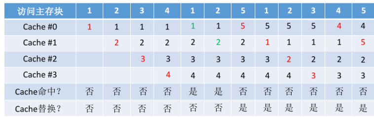
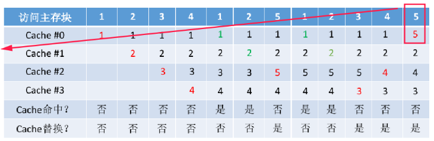
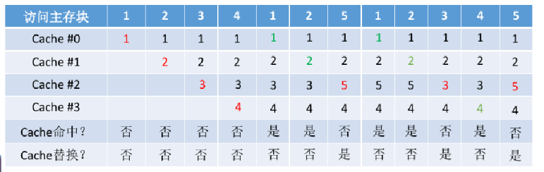

FIFO

LRU

LFU

要解决这个问题，我们首先需要理解计算机体系结构中的缓存（cache）是如何工作的，特别是直接映射（direct-mapped）和组相联（associative）缓存。

### 1. 直接映射缓存（Direct-Mapped Cache）

对于直接映射缓存，每个内存块只能映射到缓存中的一个特定位置。这通常通过地址的索引部分来确定。

给定的缓存参数：

- 4字节块（意味着每个块有4个字节）
- 128个块

#### 地址分解：

- **字节偏移（Byte Offset）**：需要多少位来表示一个字节偏移。因为有4个字节，所以需要2位（\(2^2 = 4\)）。
- **索引（Index）**：需要多少位来表示缓存中的块位置。因为有128个块，所以需要7位（\(2^7 = 128\)）。
- **标记（Tag）**：剩余的位用于标记。总位数减去字节偏移和索引的位数。

#### 地址：`0000 1000 0101 1100 0001 0001 0111 1001`

- **字节偏移**：最后2位 `1001`（十进制中的9，但因为我们是按字节计算，所以是第10个字节，这在4字节块中是不可能的，这里可能是一个错误，我们假设是最后4位 `0111` 表示字节偏移，即7）。
- **索引**：接下来的7位 `0001 0111`。
- **标记**：剩余的位 `0000 1000 0101 1100 0001`。

### 2. 8路组相联缓存（8-Way Set Associative Cache）

在8路组相联缓存中，每个缓存行可以存储8个可能的块，这意味着每个组（set）有8个条目。

#### 地址分解：

- **字节偏移**：仍然是2位。
- **组索引（Set Index）**：因为现在是8路组相联，所以需要3位来表示组索引（\(2^3 = 8\)）。
- **标记**：剩余的位用于标记。

#### 地址：`0000 1000 0101 1100 0001 0001 0111 1001`

- **字节偏移**：最后2位 `1001`（这里我们同样假设是最后4位 `0111` 表示字节偏移，即7）。
- **组索引**：接下来的3位 `011`。
- **标记**：剩余的位 `0000 1000 0101 1100 000`。

### 总结：

- **直接映射**：标记 `0000 1000 0101 1100 0001`，索引 `0001 0111`，字节偏移 `0111`。
- **8路组相联**：标记 `0000 1000 0101 1100 000`，组索引 `011`，字节偏移 `0111`。

请注意，这里的字节偏移假设可能需要根据实际的地址位数进行调整。如果地址位数是32位，那么字节偏移应该是最后2位。如果地址位数更多，需要相应地调整字节偏移的位数。
