## 序言

重新学习一下操作系统，更偏向Linux内核，结合Linux的C代码

J&Ocean编写，未经授权，不得转载！

## 概论

- 操作系统作为硬件与应用程序/用户之间的桥梁。
- 操作系统是特殊的软件层，负责提供和管理应用程序/用户对硬件资源（CPU、内存、磁盘等）的访问。
- 操作系统的角色：裁判、魔术师、粘合剂。
- 学习操作系统的重要性、实用性和趣味性。
- 操作系统的演变：串行处理 -> 简单批处理系统 -> 多程序批处理系统 -> 时间共享系统。

### 操作系统的特征

1. 并发（区别*并行*与*并发*）
2. 共享

   * 互斥共享
   * 同时访问

   以上是操作系统两个最基本的特征
3. 虚拟

   * 时分复用
   * 空分复用
4. 异步

## boot

### BIOS

BIOS是计算机启动时运行的第一个软件，basic input output system基本输入输出系统

BIOS是一个固件（firmware），通常存储在主板上的一个芯片中，这个芯片是非易失性的，意味着即使在计算机断电的情况下，BIOS中的数据也不会丢失。

> **硬件（Hardware）** ：
>
> * **定义** ：硬件是构成计算机系统的物理组件，包括但不限于处理器（CPU）、内存（RAM）、硬盘驱动器（HDD/SSD）、主板、显卡、电源、输入输出设备（如键盘、鼠标、显示器和打印机）等。
> * **特性** ：硬件是可见的、可触摸的物理实体，没有软件的配合，硬件无法执行复杂的任务。
> * **功能** ：硬件提供了运行软件和存储数据的物理平台。
>
> **软件（Software）** ：
>
> * **定义** ：软件是计算机系统中的非硬件部分，包括操作系统、应用程序、程序、协议、文档等。
> * **特性** ：软件是无形的，它由代码和数据组成，需要硬件来运行。
> * **功能** ：软件指挥硬件如何工作，执行特定的任务，如文字处理、网页浏览、游戏、数据分析等。
>
> **固件（Firmware）** ：
>
> * **定义** ：固件是一种特殊的软件，它嵌入在硬件设备中，用于控制设备的低级操作和配置。
> * **特性** ：固件通常是存储在非易失性存储器中的，它在断电后仍然可以保留数据。
> * **功能** ：固件负责设备的启动过程、硬件初始化、基本输入输出控制等任务。固件是硬件和软件之间的桥梁，它使得硬件能够按照软件的指令来操作。

以上就是固件、硬件与软件之间的区别

BIOS的主要功能；

1. 电源开启自检（POST Power-On Self Test）诊断
2. 识别连接的硬件（显示器、键盘、鼠标 etc.）并初始化它们的状态
3. 构建高级配置和电源接口（ACPI）的硬件描述。
4. 将bootloader（引导程序）从磁盘装载到内存
5. 将控制权转给引导程序

**UEFI**

Unified Extensible Firmware Interface 可扩展固件接口

- BIOS的继任者。
- 特点：更快、支持文件系统、可存储在不同位置、支持更多输入设备、安全启动、更好的用户界面。

### 引导程序

是操作系统的一部分，主要作用：

1. CPU模式从实模式转成保护模式
   CPU有很多模式

   - 实模式（Real Mode）：
     这是最简单的CPU模式，也是系统启动时的初始模式。在实模式下，CPU的操作类似于传统的16位8086处理器，没有现代保护机制。内存管理简单，没有分页或分段保护，整个内存空间都是平坦的和连续的。
   - 保护模式（Protected Mode）：
     保护模式提供了比实模式更高级的内存管理和保护特性。它支持虚拟内存、分页、分段以及更复杂的保护机制，如特权级别（ring levels）。在保护模式下，CPU可以访问更大的内存空间，并能保护操作系统免受用户级程序的干扰。
   - 长模式（Long Mode）：
     这是x86-64架构中的64位模式，它允许CPU使用超过4GB的内存。长模式提供了扩展的寄存器大小和新的指令集，以支持64位计算。它兼容保护模式，但是增加了新的特权级别和更多的内存管理功能。
   - 系统管理模式（System Management Mode, SMM）：
     SMM是一种特殊的CPU模式，用于系统管理任务，如电源管理和系统恢复。当CPU进入SMM时，它会保存当前状态并加载一个特殊的内存区域（SMM内存），在这个区域内运行特殊的系统管理代码。
   - 虚拟8086模式（Virtual 8086 Mode）：
     这是一种保护模式下的子模式，用于虚拟化和模拟多个实模式环境。每个虚拟8086模式的实例都有自己的一组寄存器和指令集，模拟一个独立的8086处理器。
   - 兼容模式（Compatibility Mode）：
     在x86-64系统中，兼容模式允许32位操作系统和应用程序在64位CPU上运行。它提供了一个类似于保护模式的环境，但是限制了某些长模式下的特性。
2. 检查内核映像是否正常
3. 从磁盘加载内核到内存
4. 将控制权转移到“真正的”操作系统

### 几个关注的点

为什么引导程序要将CPU模式从实模式转换成保护模式？

> **内存分段和保护**：
>
> 1. - 实模式下，CPU使用的是简单的20位地址空间，这意味着它只能直接访问1MB的内存。保护模式通过使用分段机制，允许CPU访问更大的内存空间，并且提供了内存保护的功能。每个段都有自己的权限和属性，可以防止用户级程序访问操作系统或其他程序的内存空间。
> 2. **硬件资源保护**：
>
>    - 在保护模式下，CPU实现了不同特权级别的保护，通常分为四个级别（Ring 0到Ring 3）。这确保了操作系统内核（运行在最高的特权级别）可以保护自己的代码和数据不受用户级程序的干扰。这是维护系统稳定性和安全性的关键机制。
> 3. **支持多任务和虚拟内存**：
>
>    - 保护模式提供了支持多任务和虚拟内存管理的必要机制。这些特性对于现代操作系统来说至关重要，它们允许多个程序同时运行，并且每个程序都认为自己拥有整个CPU和内存空间，而实际上它们是被操作系统管理和调度的。
> 4. **增强的指令集**：
>
>    - 保护模式提供了一些新的指令和功能，这些在实模式下不可用。这些增强的指令可以提高系统的性能和效率。
> 5. **支持更大的地址空间**：
>
>    - 保护模式允许使用分页机制，这使得CPU能够访问超过1MB的内存，实际上在32位系统中可以支持高达4GB的地址空间，而在64位系统中则更大。
> 6. **系统稳定性**：
>
>    - 通过在保护模式下运行，操作系统可以确保用户级程序不能执行某些可能会破坏系统的特权指令，例如直接访问硬件设备或修改其他程序的内存。这提高了系统的稳定性和可靠性。
> 7. **兼容性**：
>
>    - 虽然现代操作系统不再需要与旧的16位软件兼容，但保护模式提供了一种向后兼容的方式，允许在必要时运行旧的软件。
>
> 从实模式转换到保护模式是为了提供更安全、更高效和更强大的硬件资源管理能力

BIOS和Bootloader有什么区别？

|                 BIOS                 |                Bootloader                |
| :-----------------------------------: | :--------------------------------------: |
|   固件（特殊的软件），烧录在硬件上   |            软件，与OS一同出现            |
|     计算机上电后第一个运行的软件     | 计算机上电后第一个用户定义、可更改的软件 |
| 通常烧录在ROM上，掉电不消失，不可更改 |               与OS一同存储               |

为什么BIOS不直接加载操作系统内核？

> 1. **硬件抽象和兼容性**：
>
>    - BIOS的主要任务是进行硬件的初始化和检测。它提供了一个与操作系统无关的方式来初始化和测试硬件组件，确保硬件处于可工作状态。引导程序（Bootloader）则负责后续的具体操作系统加载过程，这样可以将硬件层面的操作与操作系统加载逻辑分离，增加系统的灵活性和兼容性。
> 2. **简化硬件设计**：
>
>    - 如果BIOS直接负责加载操作系统内核，那么每次操作系统更新或更换操作系统时，可能都需要更新BIOS，这在实际操作中是不现实的。通过使用引导程序，BIOS可以保持不变，而引导程序可以根据需要进行更新或替换。
> 3. **启动灵活性**：
>
>    - 引导程序提供了选择操作系统的灵活性。在多操作系统环境中，引导程序（如GRUB或LILO）允许用户选择要启动的操作系统，而BIOS只负责启动引导程序。
> 4. **安全性和验证**：
>
>    - 引导程序可以在加载操作系统内核之前执行安全检查和验证，例如验证启动媒体的完整性和合法性。这有助于防止恶意软件在系统启动过程中加载。
> 5. **错误处理**：
>
>    - 引导程序可以处理操作系统加载过程中可能出现的错误，如内核映像损坏或找不到操作系统。BIOS通常不具备复杂的错误处理能力。
> 6. **硬件和操作系统接口**：
>
>    - 引导程序负责将系统从BIOS状态转换到操作系统状态，包括从实模式转换到保护模式或长模式。这一过程需要特定的代码来处理，而BIOS通常不包含这些代码。
> 7. **支持新的硬件和启动标准**：
>
>    - 随着硬件技术的发展，新的启动标准（如UEFI）和启动方法不断出现。引导程序可以更容易地更新以支持这些新标准，而不需要修改BIOS。
> 8. **减少BIOS代码复杂性**：
>
>    - BIOS代码需要保持简洁和高效，以确保快速启动和最小化的启动失败率。将操作系统加载逻辑放在引导程序中可以减少BIOS的代码复杂性。
> 9. **便于操作系统更新和维护**：
>
>    - 操作系统内核和文件系统可能需要更新或维护，而不需要更改BIOS。这样可以更容易地分发操作系统更新，而不必担心与BIOS的兼容性问题。

启动进程的一个总结

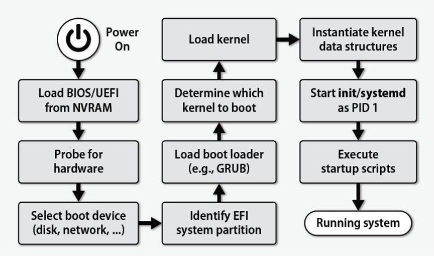

流程：

1. 上电
2. 从NVRAM（Non-Volatile Random Access Memory）加载BIOS/UEFI程序
3. 探测硬件
4. 选择启动设备
5. 确定EFI启动设备
6. 加载引导程序
7. 确定要启动的内核
8. 加载内核
9. 实例化内核数据结构
10. 启动init或systemd
11. 执行启动脚本
12. 运行系统

## Process

### 概念

一段应用程序在有限的权限下的执行过程

进程是操作系统进行资源分配和调度的基本单位

OS引入进程的目的就是为了实现程序的并发执行

* **独立性**：
  - 进程是独立运行的，拥有自己的地址空间，与其他进程相互隔离。
* **动态性**：
  - 进程的生命周期是动态变化的，从创建到结束，会经历不同的状态。
* **并发性**：
  - 多个进程可以在同一个时间段内并发执行，尤其是在多核处理器上。
* **异步性**：
  - 进程的执行不是连续的，它们可能会因为等待I/O操作或其他事件而暂停。
* **结构性**：
  - 进程由程序、数据和进程控制块（PCB）组成，PCB包含了进程状态、优先级、程序计数器等管理信息。

### PCB

是OS用于追踪进程执行状态的一种数据结构

PCB通常包括以下重要部分：

* **Process ID (PID)**：
  - 进程标识符（PID）是操作系统分配给每个进程的唯一数字标识符。它用于区分系统中的各个进程，并在进程管理、通信和调度中起到关键作用。
* **Process state**：
  - 进程状态描述了进程在生命周期中的当前状态，常见的状态包括：
    - 运行（Running）：进程正在CPU上执行。
    - 就绪（Ready）：进程已准备好运行，等待被调度。
    - 等待（Waiting）/阻塞（Blocked）：进程正在等待某个事件（如I/O操作或信号）发生，不能被调度执行。
* **Process priority**：
  - 进程优先级决定了进程在调度时获得CPU资源的优先级。高优先级的进程更有可能被优先调度。
* **Program counter**：
  - 程序计数器（PC）保存了进程下一条将要执行的指令的地址。它是CPU寄存器之一，在进程切换时需要保存和恢复。
* **Memory related information**：
  - 内存相关信息包括进程的地址空间、内存分配情况、页表等。这些信息帮助操作系统管理进程的内存使用，并在上下文切换时进行内存管理。
* **Register information**：
  - 寄存器信息包括CPU中的各种寄存器内容，如通用寄存器、程序状态字（PSW）、栈指针等。在进程被中断时，这些寄存器的值需要被保存到PCB中，以便进程恢复时能够继续执行。
* **I/O status information**：
  - I/O状态信息包括进程打开的文件描述符、分配给进程的I/O设备和被进程使用的文件列表。这些信息用于管理和跟踪进程的I/O活动。
* **Accounting information**：
  - 会计信息记录了进程的资源使用情况，如CPU使用时间、内存使用时间、进程创建时间和终止时间等。这些信息对于系统管理员进行系统监控、性能分析和计费等非常重要。

etc.

### 几个关注的点

**程序与进程**

进程是程序的一个实例

类似于“程序是死的，进程是活的”

程序是一个静态概念，被存放在磁盘当中

进程是一个动态概念，包含了程序计数器、寄存器集合、当前活动以及系统资源等状态信息

一个程序可以由0/1/n个进程执行

**什么地方用得到PCB**

- **进程创建和终止**：当系统创建一个进程时，会为进程设置一个PCB，并在进程终止时收回它的PCB。
- **进程调度**：操作系统根据PCB中的信息进行进程调度和资源分配，保证系统运行的稳定性和效率。
- **资源管理**：PCB中记录了进程所需的资源信息，操作系统根据这些信息对系统资源进行管理和分配。
- **进程通信**：操作系统通过PCB来管理进程间的通信和同步操作。
- **上下文切换**：在上下文切换过程中，操作系统将当前进程的状态保存到PCB中，并从下一个进程的PCB中恢复状态。

**进程的内存映象**

包括

* 代码段
* 数据段
* 进程控制块
* 堆
* 栈

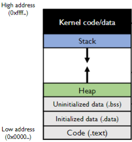

为什么内核区在高地址

* **保护内核安全**：内核是操作系统的核心，负责管理系统资源和控制硬件设备。将内核放置在高地址区域可以有效地将其与用户空间程序隔离，防止用户程序直接访问或修改内核代码和数据，从而保护内核免受损害。
* **提高访问硬件的速度**：硬件设备的寄存器通常映射在物理内存的高地址区域。将内核放在高地址可以减少内核访问这些硬件寄存器时的页表映射次数，提高访问速度。
* **避免地址冲突**：内核空间需要占用一部分内存地址。如果内核被放置在低地址区域，那么在多个程序运行时，它们的地址空间可能会与内核空间发生冲突。将内核放在高地址可以减少这种冲突，确保用户程序地址空间的连续性和一致性。
* **提高系统稳定性**：内核作为系统中最稳定的部分，其代码和数据的地址应该是固定的，以便在任何时候都能被准确地访问。将内核放在高地址区域，可以保证内核空间的固定不变，即使用户程序的地址空间发生变化，也不会影响到内核。
* **内存管理效率**：在32位系统中，虚拟地址空间总共有4GB。Linux系统通常将这4GB空间分为内核空间和用户空间，内核占用最高的1GB，用户占用低的3GB。这种划分方式使得内核空间固定，当程序切换时，只需要改变用户程序的页表，而内核页表保持不变，从而提高了内存管理的效率。
* **共享内核空间**：由于内核空间是被所有进程共享的，将其放在高地址区可以确保所有进程都能访问到相同的内核代码和数据，这对于系统调用和中断处理非常重要。

## Dual Mode

### 概念

双模：内核态和用户态

为了实现CPU虚拟化，在同一时间间隔中运行多个进程，实现多道批

高效 、可控地实现虚拟化最基本的方法就是

定义LDC limited direct execution受限直接执行

特征

1. 受限制的操作
   敏感操作由操作系统完成
2. 进程切换

实现隔离保护的硬件，从以下几个方面进行考虑：

* 特权指令的实现
* 内存保护
* 时钟中断
* 安全的模式转换

### 特权指令

特权指令包括

* **I/O读写（I/O read/write）**：直接对输入/输出设备进行读写操作。
* **上下文切换（Context switch）**：在不同的进程或线程之间切换执行环境。
* **改变特权级别（Changing privilege level）**：调整当前执行代码的权限级别，比如从用户态切换到内核态。
* **设置系统时间（Set system time）**：修改系统的时钟设置。

区别于非特权指令

如果一个程序非法执行了一条特权指令，进程通过硬件逻辑探测到非法执行，然后抛出异常，进程停止，OS接管

### 内存的保护

这里涉及到虚拟内存实现

#### dynamic relocation

动态分区分配

整个物理内存动态分区分配，容易产生碎片

p-address=base+v-address

引入base和bound寄存器，分别代表多个物理地址的基址和多个允许访问物理地址的范围

每一个内存许可都会向上述寄存器进行检查

虚拟地址需要小于允许访问物理地址

#### segmentation

分段方法

每个段都有一个base和bound寄存器

每一个内存许可都会向各段中的上述寄存器进行检查

符合则分配

虚拟地址需要小于允许访问物理地址

内核态绕过了

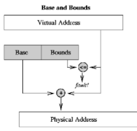

缺点

* 堆栈区无法拓展
* 内存无法实现共享
* 内存的碎片化

etc

#### paging

分页方法

对于一个正在运行的进程来说，它所访问的虚拟内存地址（即它认为的内存地址）并不直接对应于物理内存中连续的地址

这一部分应该在虚拟内存中进行展开

### 时钟中断

是OS重新控制CPU的一种方法

时钟中断后，时间片耗尽，OS决定另一个进程执行

### 几个关注的点

如何查看当前特权等级

x86架构中用CS段寄存器的低2位记录CPL Current Privilege Level

## Context Switch

上下文切换

这里主要讲的就是用户态-内核态切换的类型

异常、中断、系统调用造成OS工作状态切换

### 异常

也叫内中断

来自CPU执行指令内部的事情，如程序的非法操作码、地址越界、运算溢出、除0、虚拟存储缺页，异常不能被屏蔽，出现就需要处理

### 中断

称外中断

来自CPU执行指令外部的事情，I/O、时钟中断等

#### Interrupt Vector Table

中断向量表是一个数据结构，存储了实模式中每种中断的处理程序地址。当中断发生时，CPU通过中断向量表找到相应的处理程序并执行。

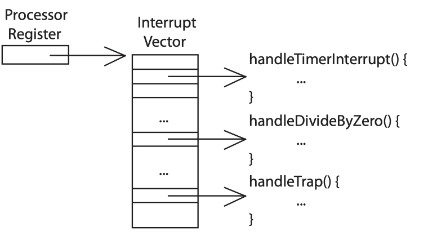

进程发起中断请求，查询中断向量表，找到对应中断的引导入口

#### Interrupt Descriptor Table

中断描述符表IDT告诉CPU中断服务程序（Interrupt Service Routines）的位置，用于保护模式

每个表项被称为门描述符

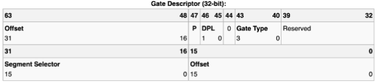

分成两段的原因是为了和中断向量表兼容，实现实模式和保护模式之间的兼容性

中断流程

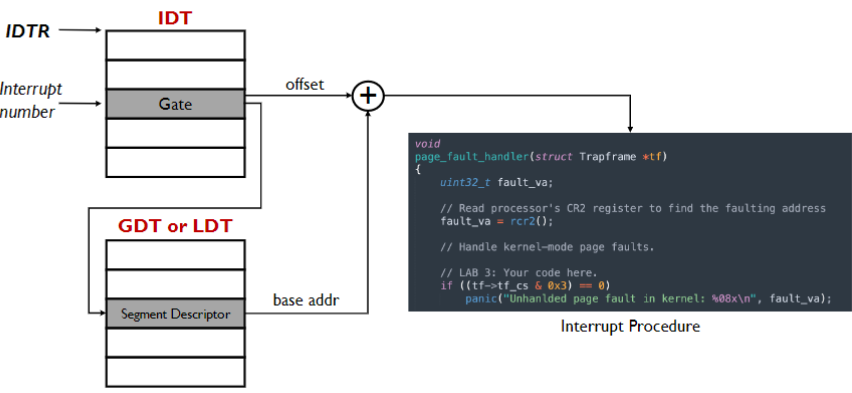

#### Interrupt Masking

中断屏蔽

禁止中断和使能中断是特权操作

中断分为可屏蔽中断和不可屏蔽中断

可屏蔽中断包括所有软件中断、系统调用以及一部分的硬件异常

不可屏蔽中断包括一部分硬件异常

**中断控制器用于进行上述操作**

**中断栈**

在内核态存储中用于保存中断进程状态的一个特殊栈

没有中断时为空

为了安全和可靠性不直接使用用户态的栈区

### 系统调用

trap，系统自陷命令，用于在用户态先调用OS内核态

### 内核态-用户态模式转换

发生的时间

* 新的进程
* 中断/异常/系统调用后继续已有进程
* 时钟中断后转换进程
* 用户层级的upcall

#### upcall

Upcall机制允许应用程序实现类似操作系统的功能

发生的时间点

* 异步I/O
* 进程间通信
* 用户层级异常处理
* 用户层级资源分配

### 几个关注的点

中断/异常/系统调用硬件反应流程

1. 屏蔽中断
2. 将特殊寄存器的值存入其他临时寄存器
3. 转换到内核态中断栈
4. 将三个关键值压入中断栈
5. （可选）保存错误码
6. 调用中断解决器
7. 保存中断进程的状态
8. 执行解决器
9. 继续中断进程

## OS Interfaces and Syscalls

### 操作系统编程接口

操作系统给应用开放的函数：

* 进程管理
* I/O
* 线程管理
* 内存管理
* 文件系统于存储
* 网络
* 图形化/窗口
* 授权与安全

系统调用函数

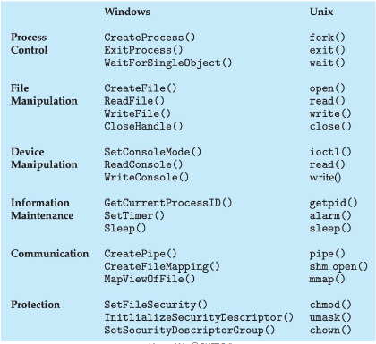

POSIX和libc

可移植操作系统接口Portable Operating System
Interface

是UNIX操作系统的一种标准，它定义了操作系统的API、命令行接口和实用工具，使得软件尤其是系统调用能够在多个Unix类系统上移植和运行

libc是一组提供C编程语言标准功能的库，包括输入/输出、字符串处理、内存管理等函数，用于支持C程序的开发和运行。

由POSIX的API+标准C语言函数

应用不直接调用系统调用，如果一款软件只由libc编写，则拥有良好的跨操作系统/硬件平台的可移植性

### 以进程管理为例

多进程需求

在windows下的进程管理

```c
Boolean CreateProcess(char *prog,char &args)
```

* 用于在内核态创建、初始化PCB
* 创建初始化一块新的内存地址空间
* 将程序 `prog`加载到地址空间
* 将参数 `args`拷贝进地址空间的内存
* 初始化硬件文本开始执行
* 告知新进程开始运行

Unix类操作系统下的进程管理

```c
fork() exec()
```

`fork()`用于创建一个与父进程完全相同的子进程，除了返回值不同。在子进程中，`fork()` 返回 `0`；而在父进程中，`fork()` 返回子进程的 PID（进程标识符）。这使得父子进程可以根据返回值来区分执行路径。

```c
fork()
```

1. 创建初始化PCB
2. 创建一个新地址空间
3. 复制内存内容到子进程中
4. 继承父进程的执行内容
5. 告知新进程就绪

```c
exec(char *prog,char *args)
```

1. 将程序 `prog`加载到地址空间
2. 将参数 `args`拷贝进地址空间的内存
3. 初始化硬件文本开始执行

### 以IO为例

unix位IO设备只定义了一个接口，将每一个IO设备都视作一个文件，定义了 `open`,`read`,`write`,`close`操作

```c
#include <fcntl.h>
int open(const char *pathname, int flags);
int open(const char *pathname, int flags, mode_t mode);

//return value: file descriptor or error code (-1)
//pathname: could be a file (“/data/readme.txt”) or a device (“/dev/zero”)
```

```c
#include <fcntl.h>
int close(int fd);
//return value: 0 (success) or -1 (error)
//Note: if fd is the last file descriptor referring to the
//underlying open file description, the resources associated with the open file description are freed.
```

```c
#include <fcntl.h>
ssize_t read(int fd, void *buf, size_t count);
//It will read up to count bytes from file descriptor fd into the buffer starting at buf.
//return value: the number of bytes read or error (-1)
```

```c
#include <fcntl.h>
ssize_t write(int fd, const void *buf, size_t count);
//It will write up to count bytes from the buffer starting at buf to the file referred to by the file descriptor fd.
//return value: the number of bytes written or -1 (error)
```

在使用前必须open

字节导向意味着数据的传输和存储是以单个字节为基本单位进行的。即使在传输过程中采用了块（block）传输的方式，内存或存储设备上的寻址仍然是基于字节的

内核缓冲读/写

通过显式调用关闭操作（如 `close()` 函数），可以确保内核及时释放与文件描述符或其他资源相关的内核数据结构

将接口扩展到进程间通信

### 系统调用

关键是防止出现用户态的错误

解决方案就是使用系统调用存根System Calls Stub

系统调用存根是一组在用户空间实现的函数，用于封装和简化对内核系统调用的访问

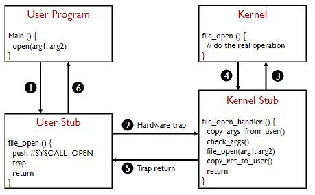

## Threads

### 概念

**并发 已经在前面进行讲解**

线程是一个单一的执行序列，代表一个可以单独调度的任务

* **轻量级** ：与进程相比，线程的创建和切换开销较小。
* **共享资源** ：同一进程中的线程共享内存和其他资源，但拥有各自的栈和寄存器。
* **并发执行** ：多个线程可以并发执行，提高程序的性能和响应能力。

区别于线程

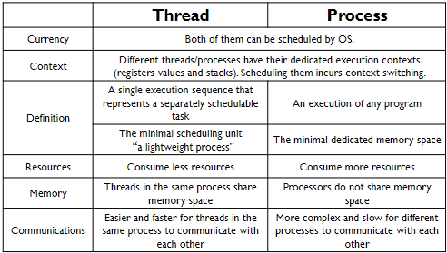

POSIX中提供了线程的API

线程的生命周期

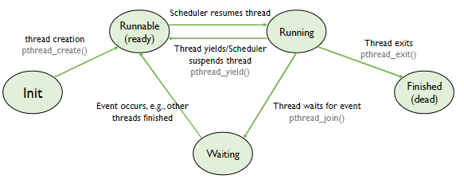

1. **新建（Init）**
   * 创建线程对象，但线程尚未启动。
   * 处于初始状态，尚未就绪执行。
2. **就绪（Runnable）**
   * 线程已创建并准备运行。
   * 等待操作系统调度分配CPU时间片。
3. **运行（Running）**
   * 操作系统调度线程执行。
   * 线程正在执行任务。
4. **阻塞（Waiting）**
   * 线程因等待某些条件或资源而暂停执行。
   * 常见原因包括等待I/O操作完成、获取锁或其他同步机制。
5. **终止（Finished）**
   * 线程完成执行或被强制终止。
   * 释放所有资源，生命周期结束。

### TCB

和进程类似，线程有线程控制块Thread Control Block（TCB）

线程控制块是操作系统用于管理和跟踪每一个线程的关键数据结构

* 线程ID
* 优先级
* 线程状态
* 栈指针

  指向线程的栈顶，用于管理函数调用和局部变量。
* 处理器寄存器的复制

共享的状态

* 代码区
* 全局变量
* 堆变量

### Implementation

内核级线程和用户级线程

#### Create

* 分配每一个线程的资源：TCB和栈
* 初始化线程资源
* 进入就绪队列

#### Switch

自主内核级线程上下文切换 `thread_yield()`

被动内核级线程上下文切换：中断/异常

主动线程上下文转换

* 关闭中断
* 取下一个就绪线程
* 将当前线程标记为就绪
* 将当前线程加入就绪队列
* 保存所有寄存器和栈指针
* 设置新线程的栈指针
* 设置所有寄存器的值

```c
void thread_yield() {
    TCB *chosenTCB;
    disableInterrupts(); // why??
    chosenTCB = readyList.getNextThread();
    if (chosenTCB == NULL) {
        // Nothing to do here
    } else {
        runningThread->state = READY;
        readyList.add(runningThread);
        thread_switch(runningThread, chosenTCB);
        runningThread->state = RUNNING;
    }
    enableInterrupts();
}
void thread_switch(oldTCB, newTCB) {
    pushad;
    oldTCB->sp = %esp;
    %esp = newTCB->sp;
    popad;
    return;
}
```

被动内核级线程的上下文转换

* 保存状态
* 运行内核的解决器
* 设置状态

与用户态转换相似但是不同的是：

* 不需要转换模式
* 解决器可以加载任何就绪队列中的线程，而用户态只能转换被挂起的

#### Delete

* 将线程从就绪队列中移出，线程将不再运行
* 释放分配给线程的资源

避免线程自我删除的解决方案：

* 线程将自己的TCB从就绪队列中移到结束线程队列
* 让其他线程free那些结束的线程

#### Multi-threaded Processes

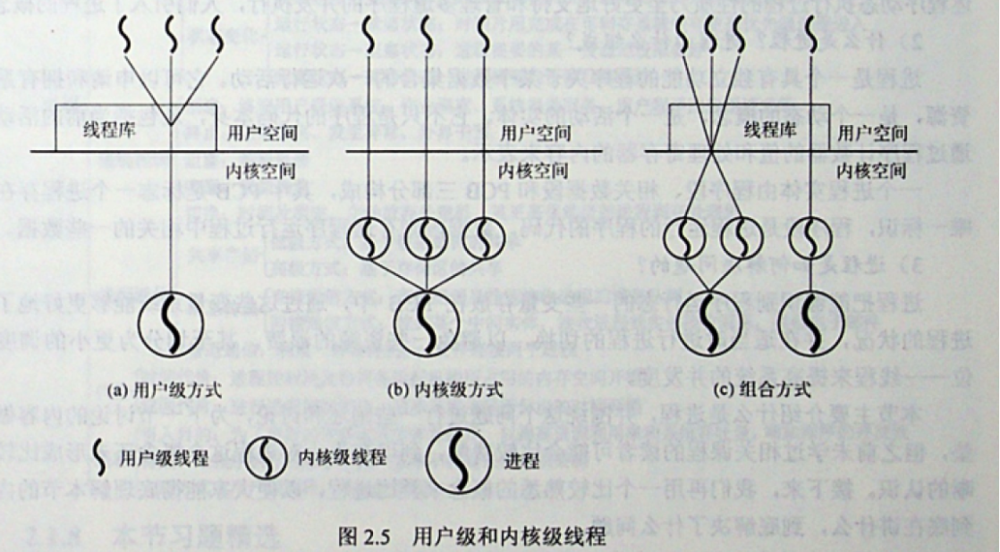实现多线程进程：

* 通过内核级线程
* 用户级库
* 混合模式

**通过内核级线程**

创建一个用户级线程

* 用户库分配一个用户级栈
* 调用 `thread_create()`系统调用
* 将创建的TCB指针存入对应进程的PCB

创建一个内核级线程

* 在内核分配线程资源
* 初始化线程状态
* 将创建的TCB放进就绪队列

**通过用户级线程库**

通过调用线程库中的派生例程创建新线程

线程库决定运行的线程

线程操作只是一个过程调用

所有工作都在用户态完成，因此OS内核意识不到线程的存在

**组合模式**

基于内核级线程的优化

内核支持创建多个内核级线程，一个内核级线程对应多个用户级线程

## Address Translation

在前面双模式的时候提到过内存管理

在OS发展的过程中，引入了虚拟内存，区别于物理内存

### 局部性原理

* **时间局部性（Temporal Locality）**
  * **定义** ：如果某个资源在某一时刻被访问，那么在不久的将来它很可能会再次被访问。
* **空间局部性（Spatial Locality）**
  * **定义** ：如果某个资源被访问，那么其相邻或附近的资源也很可能会被访问。

基于局部性原理，在装入程序的时候，仅将程序当前运行需要的页面/段装入内存，其余部分留在外存，所访问信息不在内存才*请求调页*

内存空间不够时，将暂时不用的页面调出，为*页面置换*

虚拟存储器因此有三个主要特征：

1. 多次性
2. 对换性
3. 虚拟性

从逻辑上扩充了内存的容量，对于用户来说看到的内存容量远大于实际容量

从虚拟内存地址到物理内存地址需要转换

地址转换的目的

* 内存保护
* 内存共享
* 灵活的内存分配
* 稀疏地址
* 查找效率
* 紧凑转换表
* 可移植性

转换存在时

处理器/OS使用虚拟地址

物理内存使用物理地址

### Segmented Memory

#### base and bounds registers

这是最简单的一种方式，就是引入base和bounds寄存器

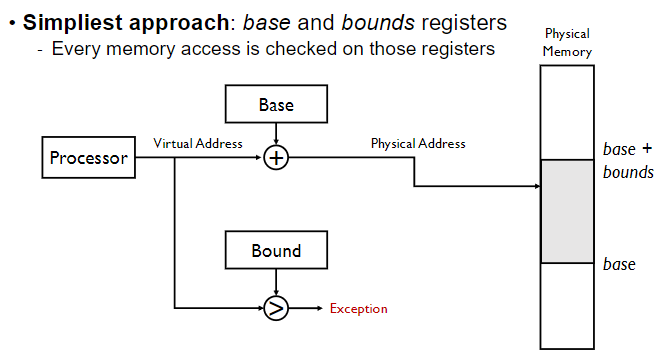

#### segment table

段表的表项就是一组base和bound寄存器

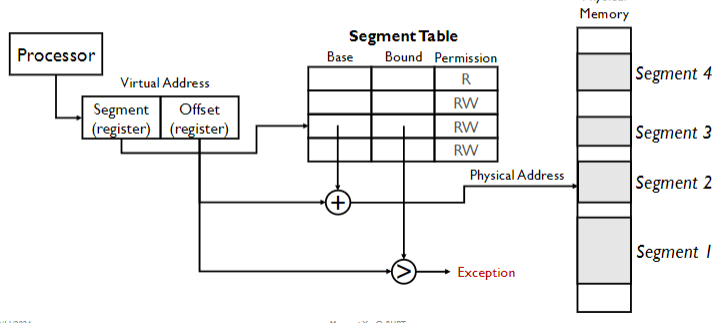

内存分配、释放导致的碎片化，外部碎片

如果程序访问了这些碎片会导致段错误

分段仍是一种粗粒度的内存管理方式，除了会产生外部碎片，当一个段很大但是很稀疏的时候，也会产生分配物理空间浪费的情况。

在实模式是没有段表的

在保护模式下，段表被称为全局描述符表GDT或者局部描述符表LDT

```
Linear address=base address + offset
```

分段的优势：

* 访问控制
* 代码共享
* 进程间通信
* 动态分配内存的高效管理

劣势：

管理大量可变大小和动态增长的内存段所带来的开销巨大

* 外部碎片
* 内存压缩效率低下
* 内存段动态增长时分段会非常复杂

### Paged Memory

#### 概念

分页管理

页框（Page Frame）是物理内存被划分成的固定大小的块，是分页内存管理机制中的基本单位。每个页框的大小通常与虚拟内存中的页（Page）大小相同（例如，4KB）。页框用于存储虚拟页的实际数据，使得虚拟地址能够有效地映射到物理地址。

每个进程都有自己的页表，页表的每个条目（Page Table Entry, PTE）包含指向物理页框（Page Frame）的指针，以及与该页相关的控制信息。不需要存储bound

页在物理内存中的分散分布

页内访问的连续性

内存分配简化，找到页框即可

#### 单层分页

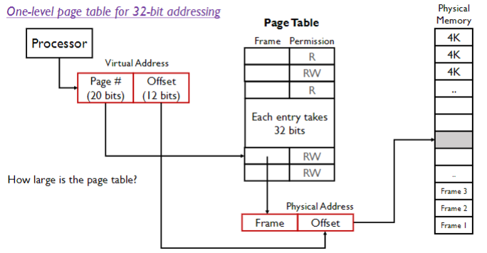

单层页表解决了大部分问题，但是单层分页造成页表庞大，开销可能比进程还大

#### 多层分页

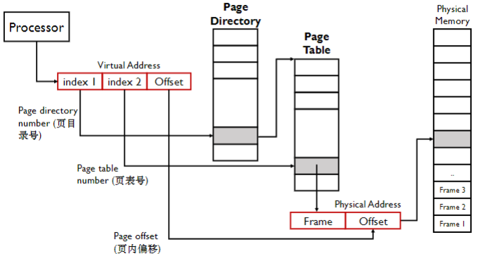

处理器得到一个虚拟地址，该地址包括页目录号、页表号和页内偏移

处理器使用虚拟地址中的页目录号作为索引，去查找页目录（Page Directory）；页目录存储在内存中，每个条目包含页表的物理帧号。

找到页目录条目，处理器使用虚拟地址中的页表号作为索引，去查找页表（Page Table）。

物理地址 = 物理帧号 * 页大小 + 页内偏移

#### x86架构多层分页

内存分配管理单元MMU负责实际地址转换，

页面尺寸部门太大也不能太小，太小会造成缓存命中率降低，太大会造成内存浪费

每个进程拥有独立页表

页表可以是稀疏的

#### Page Fault

缺页中断

CPU或内存管理单元（MMU）访问一个未被映射到物理内存的虚拟内存地址时发生的中断

分为软中断和硬中断

软中断包括页面置换，共享页面

硬中断包括写入只读页面，访问未分配页面

#### Manipulating Page Table

操作系统如何通过虚拟地址操纵页表

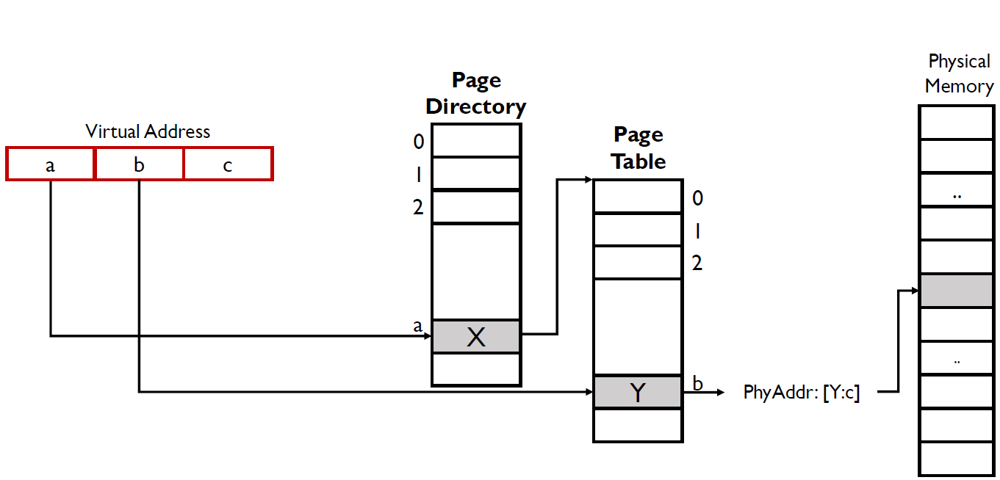

虚拟地址是 `a:b:c`

根据给出的页目录号a，查找到页表物理地址X

根据X，加上中间部分b的偏置，`[X:b]`查找到页框的物理地址Y

将上述物理地址和c（offset）进行组合得到物理地址 `[Y:c]`，这是最终访问的物理地址

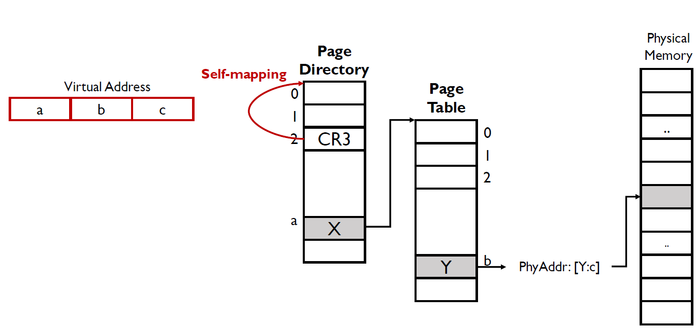

CR3能够自映射，假设CR3的地址是 `0b10`，如果有高位虚拟地址查找CR3，则返回页目录的物理地址，因此相当于循环查找了一次

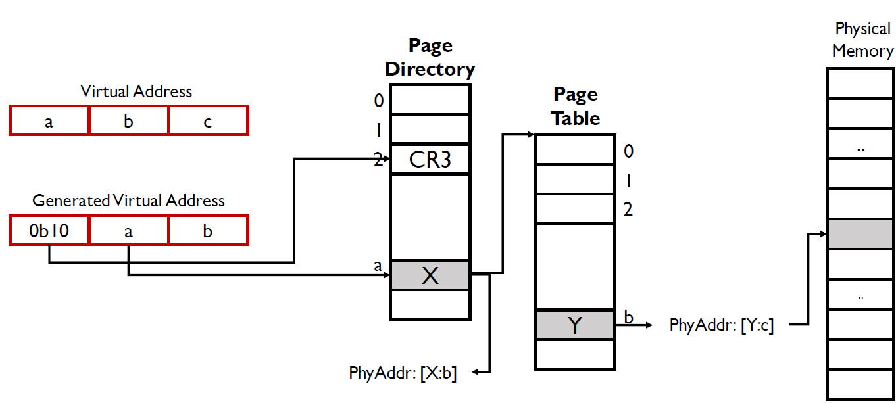

如果想要获得页框的物理地址Y

高位虚拟地址 `0b10`查找CR3，返回页目录的物理地址

结合页目录的物理地址和中间虚拟地址 `a`查找到页表物理地址X；

结合页表物理地址X和低位虚拟地址b，查找到页框Y的物理地址 `[X:b]`

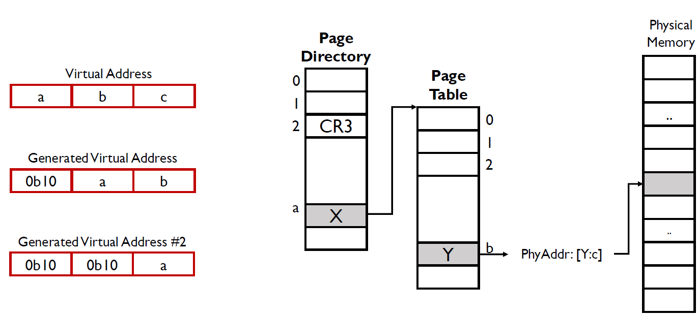

如果想要获得页表物理地址X

高位虚拟地址 `0b10`查找CR3，返回页目录的物理地址

结合页目录的物理地址和中间虚拟地址 `0b10`，返回页目录的物理地址

结合页目录的物理地址和低位虚拟地址 `a`查找到页表物理地址X；

#### Segments+Paging

由于段式分配粗粒度，页式细粒度，段页式能够兼顾效率与开销

高层使用段式+低层页式

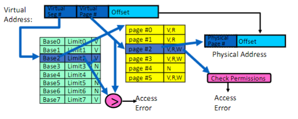

### Copy On Write

COW写时复制，用于延迟或避免不必要的内存复制操作。它允许多个进程共享相同的内存页，直到其中一个进程尝试修改该页时，才进行实际的内存复制。

当一个进程创建一个新的进程（如通过 `fork()` 系统调用），父进程和子进程共享相同的物理内存页。这些共享的页被标记为只读，以防止任何进程修改它们。

当任一进程尝试写入共享的只读页时，会触发一个页面错误（Page Fault）。操作系统捕获这个页面错误，并为尝试写入的进程分配一个新的物理页，将原始页的内容复制到新页中。

在 fork() 后紧接着 exec() 的情况下，实际复制的页数为零。这是因为 fork() 使用写时复制技术，父子进程共享相同的物理内存页，而 exec() 会用新的程序替换当前进程的内存空间，原有的共享内存页将被释放，不再需要进行复制。这种机制提高了系统的效率，减少了不必要的内存复制操作。

## Cache

### concepts

缓存（Cache）是一个用于存储副本的存储库，这些副本可以比原始数据更快地访问

缓存的主要目的是加速对频繁访问的数据的访问速度。通过将常用数据存储在缓存中，可以减少访问原始数据的时间，提高系统性能。

缓存的有效性依赖于高缓存命中率（Cache Hit Rate）。缓存命中率是指访问请求在缓存中找到所需数据的比例。高缓存命中率意味着大多数访问请求都可以在缓存中找到，从而减少访问原始数据的次数。

平均访问时间

$$
\text{Average Access Time} = (\text{Hit Rate} \times \text{Hit Time}) + (\text{Miss Rate} \times \text{Miss Time})
$$

引入cache的原因

处理器计算的速度远快于IO访问

能够引入Cache的关键

Locality 局部性

* **时间局部性（Temporal Locality）**
  * **定义** ：如果某个资源在某一时刻被访问，那么在不久的将来它很可能会再次被访问。
* **空间局部性（Spatial Locality）**
  * **定义** ：如果某个资源被访问，那么其相邻或附近的资源也很可能会被访问。

针对时间局部性，将近期访问的数据放置在靠近处理器的地方

针对空间局部性，将连续的内存块移动到上层缓存中

存储器层次结构

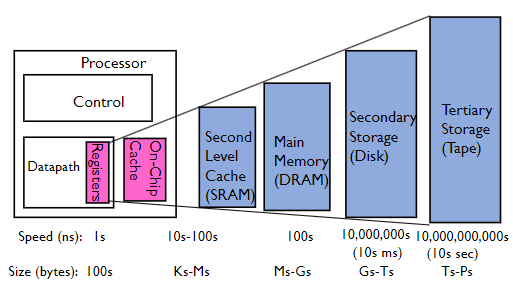

1. 处理器寄存器
2. 片上Cache-TLB Translation Lookaside Buffers
3. 二级Cache
4. 内存（DRAM）
5. 硬盘（SSD）
6. 磁带

为了解决多级地址转换带来的访存远远慢于CPU，引入了Cache

### TLB

转换检测缓冲区（Translation Lookaside Buffer, TLB）是一种位于内存管理单元（MMU）中的特殊缓存，用于加速虚拟地址到物理地址的转换。TLB 缓存了最近使用的页表条目，从而减少了每次内存访问时的页表查找开销。

- 当 CPU 生成一个虚拟地址时，MMU 首先在 TLB 中查找该虚拟地址对应的页表条目。
- 如果在 TLB 中找到（称为 TLB 命中），则直接使用缓存的物理地址进行内存访问。
- 如果在 TLB 中未找到（称为 TLB 未命中），则需要访问页表进行地址转换，并将结果缓存到 TLB 中，以便后续访问加速。

TLB 通常由一组高速缓存条目组成，每个条目包含一个虚拟页号（VPN）和对应的物理页框号（PFN），以及一些控制信息（如访问权限、有效位等）。

#### TLB lookup

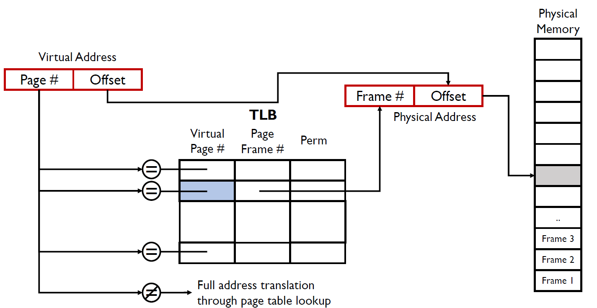

以上是能够命中TLB的情况

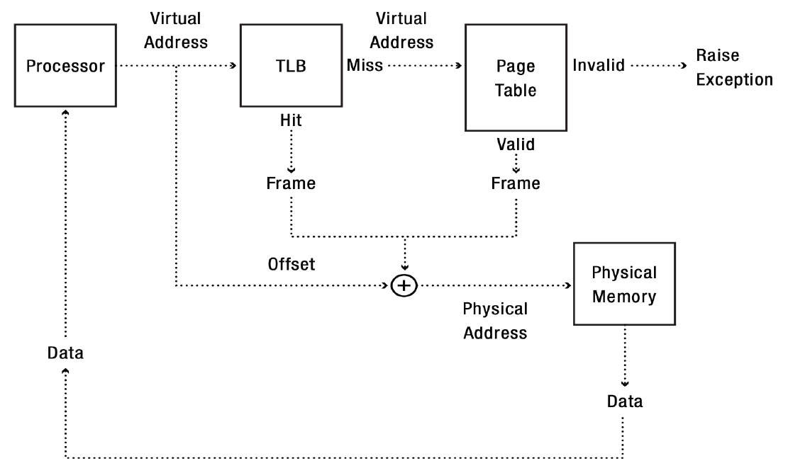

这里解释了带TLB完整的地址转换流程

如果命中就从TLB中找到页框的物理地址和偏置组成完整的物理地址，如果没有命中就得查询页表

TLB通常是组相联（Set-Associative），用于减少地址转换过程中比较操作的数量

地址转换的表现与TLB的高命中相关

#### TLB miss

原因

1. 页面未被访问过
2. 由于 TLB 大小有限，页面被置换
3. 由于关联性导致的页面映射冲突
4. 其他进程更新页表.

硬件遍历页表

在硬件遍历页表的系统中，当发生 TLB 未命中时，内存管理单元（MMU）会自动遍历当前的页表来填充 TLB

软件遍历页表

在软件遍历页表的系统中（如 MIPS 架构），当发生 TLB 未命中时，处理器会收到 TLB 错误，并由内核负责遍历页表

#### TLB表现

关键指标：命中率

提高 TLB 命中率的两种技术：超级页和预取

**超级页**

超级页（Superpage）是一种将多个连续的小页（通常为 4KB）合并成一个较大的页（如 2MB 或 1GB）的技术。通过使用超级页，可以减少页表项的数量，从而提高 TLB 命中率。

**预取**

预测程序的内存访问模式，并提前将可能需要的页表项加载到 TLB 中的技术

* 顺序预取 将顺序访问内存地址，并提前加载连续的内存块到缓存中
* 跨步预取 以固定步长访问内存地址，并提前加载这些地址到缓存中
* 相关预取 利用历史访问模式，预测程序将访问的内存地址

CPU 预取的有效性与 CPU 流水线的关系

#### TLB Consistency

缓存一致性（Consistency）是指缓存中的数据必须与原始数据保持一致，特别是在缓存条目被修改时

包括进程上下文切换、权限减少和 TLB 清除（TLB Shootdown）

**进程上下文切换**

解决上下文切换导致一致性问题的直接办法是刷新TLB

在进程上下文切换时，操作系统会刷新 TLB（Translation Lookaside Buffer），清除所有缓存的页表条目。

现代方法是使用带标签的TLB

现代处理器使用带标签的 TLB，每个 TLB 条目除了存储虚拟地址和物理地址的映射外，还存储一个进程标识符（ASID，Address Space Identifier）。

进程标识符用于区分不同进程的页表条目，即使不同进程的虚拟地址相同，带有不同 ASID 的 TLB 条目也不会冲突。

在上下文切换时，操作系统只需更新当前进程的 ASID，而不需要刷新整个 TLB。

**权限减少**

- 当操作系统减少某个内存区域的访问权限（如从可写变为只读）时，缓存中的数据可能仍然具有旧的权限。
- 如果不处理缓存一致性问题，可能会导致进程在缓存中修改只读内存区域的数据，造成数据一致性问题。

解决办法

- **早期解决办法：刷新缓存** 在权限减少时，操作系统可以刷新相关内存区域的缓存，以确保缓存中的数据具有正确的权限。
- **现代：更新缓存条目** 操作系统可以更新缓存条目的权限信息，以确保缓存中的数据权限与内存区域的权限一致。

**TLB击落**

TLB击落（TLB Shootdown）是指在多处理器系统中，当一个处理器修改页表条目时，需要通知其他处理器刷新其 TLB，以确保所有处理器的 TLB 中的页表条目一致。

多线程场景，通常由处理器间中断发生

刷新进程

1. 操作系统修改页表
2. 发送 TLB 刷新请求
3. 处理器刷新 TLB
4. 处理器发送确认
5. 原始处理器等待确认

批处理 TLB 清除请求能够降低开销

### Memory Cache

缓存存储器是为了平衡CPU处理速度和DRAM存储访存速度差异

块（Block）是缓存中存储数据的最小单位。一个块通常包含多个字（word）或字节（byte），以利用空间局部性（Spatial Locality），即程序在访问某个存储位置时，很可能会在不久的将来访问其附近的存储位置。

在缓存查找过程中，地址字段被分为三个部分

**标签（Tag）**：

- 用于标识缓存块的唯一标识符。
- 标签字段的大小取决于缓存的大小和块的数量。

**索引（Index）**：

- 用于确定缓存中的哪一行存储了该块。
- 索引字段的大小取决于缓存行的数量。

上面两个组成块地址

**块内偏移（Block Offset）**：

- 用于确定块内的具体字节位置。
- 块内偏移字段的大小取决于块的大小。

#### Cache lookup

全相联映射、直接映射和N路组相联映射

**全相联映射**

每个内存地址可以存储在缓存表中的任何位置。

在查找时，需要将地址标签与缓存中所有条目的标签进行比较。

优点

- **高缓存命中率**：由于每个地址可以存储在任何位置，缓存利用率高，命中率高。
- **灵活性**：可以最大限度地利用缓存空间，减少缓存未命中。

缺点

- **查找速度慢**：需要比较所有缓存条目的标签，查找速度较慢。
- **硬件复杂度高**：实现复杂，需要更多的硬件资源进行并行比较

**直接映射**

每个内存地址只能存储在缓存表中的一个特定位置，这个特定位置由哈希函数决定

通过地址中的索引字段直接计算出缓存位置

步骤

1. 索引选择潜在块
2. 标签验证块
3. 字节选择块内字节

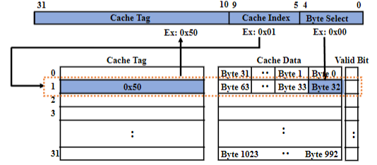

优点

- **查找速度快**：通过索引字段直接计算出缓存位置，只需比较一个标签，查找速度快。
- **硬件实现简单**：实现简单，硬件复杂度低。

缺点

- **低缓存命中率**：由于每个地址只能存储在一个位置，容易发生冲突，命中率较低。
- **灵活性差**：缓存利用率低，容易导致缓存未命中。

颠簸（Thrashing）：频繁使用两个或多个映射到同一缓存条目的地址，导致缓存频繁替换，严重影响缓存命中率和系统性能。

$$
Cache Index=Memory Index \ \% \ CacheNumber
$$

**N路组相联**

每个内存地址可以存储在 N 个缓存组中的一个位置

通过地址中的索引字段计算出缓存组，然后在组内进行标签比较。

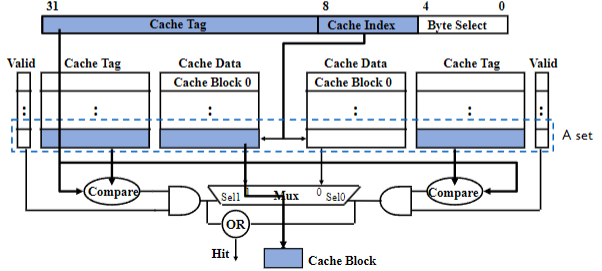

以二路组相联为例解释查找过程

1. 索引选择组
2. 标签验证块
3. 字节选择块内字节

$$
Cache Group Index= Memory Index \  \% \ Cache Group Number
$$

N=1时成为直接映射

N=缓存块数量时成为全相联映射

#### Cache Replacement

直接映射只有一种可能性，就是直接替换

组相联或全相联替换方式比较多

* 随机替换
* First In First Out 先进先出 FIFO
* LRU Least Recently Used 最近最少使用替换
* LFU Least Frequently Used最小频率使用替换

#### Cache Write Policies

缓存写策略包括写直达和写回两种

**写直达**

信息同时写入缓存和主存

优点：

**读未命中不会导致写操作** 由于数据始终与主存同步，读未命中时无需进行写操作

缺点：

**处理器在写操作时被阻塞** 每次写操作都需要等待数据写入主存，处理器可能会被阻塞，除非使用写缓冲。

**写回**

信息只写入缓存，只有在缓存块被替换时才写入主存

优点：

**重复写操作不发送到主存** 多次写操作只更新缓存，不会频繁访问主存，减少了写操作的开销

缺点：

**实现复杂** 需要管理缓存块的状态，增加了实现复杂度。

**读未命中可能需要写回脏数据** 在读未命中时，如果被替换的缓存块是脏数据，需要先写回主存。

**需要脏位** 需要一个脏位（Dirty Bit）来标记缓存块是否被修改。

#### Addressed Virtually/Physically

不同层级的cache使用不同方式的编址

在MMU转换地址之后的所有地址都是物理地址

TLB未命中的代价非常高，所以为了减少 TLB 未命中的影响，可以重叠 TLB 和一级缓存的访问，因为它们都位于 CPU 内部

重叠TLB和一级缓存

**虚拟地址偏移覆盖缓存索引和字节选择**

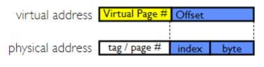

在地址转换的同时进行缓存查找

另外一种解决方案：虚拟索引、虚拟标签（VIVT），缓存的索引和标签都是基于虚拟地址的

一级缓存几乎虚拟索引物理标签，二三级缓存几乎物理索引物理标签

#### Address Translation (Full Version)

无Cache

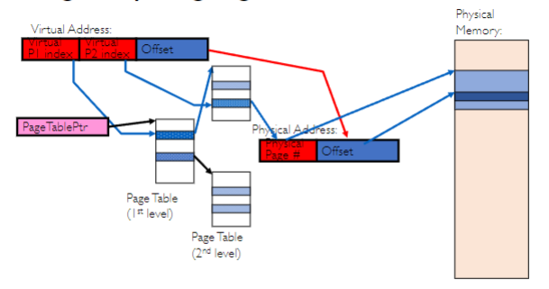

加入TLB

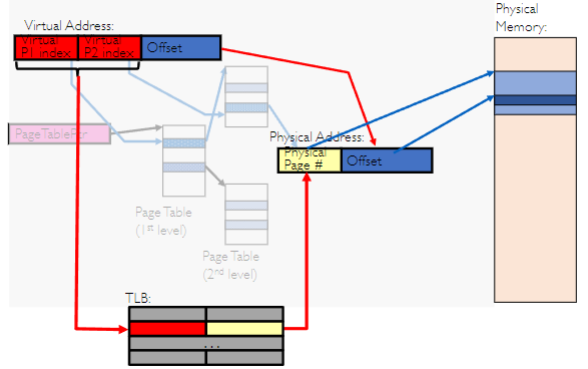

加入Cache

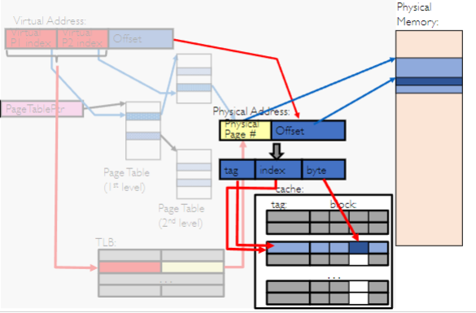

#### Page Coloring

页着色（Page Coloring）或缓存着色（Cache Coloring）是一种优化技术，用于减少应用程序中的缓存未命中

通过控制物理内存页的分配，使得不同的虚拟页映射到不同的缓存组，从而减少缓存冲突，提高缓存命中率

两个连续使用的虚拟页可能会映射到相同的缓存组，导致缓存冲突。在操作系统将它们映射到物理页时，物理页号的最后两位相同。这样，两个页内相同偏移的地址会争夺同一个缓存组，导致缓存未命中和性能下降

解决方案

* **物理页着色（Coloring the Physical Pages）**：
  - 将物理页与缓存组进行着色，使得不同颜色的物理页映射到不同的缓存组。
  - 通过控制物理页的分配，确保连续的虚拟页映射到不同颜色的物理页，从而减少缓存冲突。
* **映射应用程序页到尽可能多的颜色（Maps the Application Pages to as Many Colors as Possible）**：
  - 在分配物理页时，尽量将应用程序的虚拟页映射到不同颜色的物理页。
  - 通过增加颜色的多样性，减少缓存组的争夺，提高缓存命中率。

页着色只在L2/L3缓存适用

L1缓存通常较小，缓存块数量有限。页着色技术在较小的缓存中效果不明显

L1缓存通常使用虚拟地址进行访问，以减少地址转换的延迟。页着色技术主要针对物理地址缓存，因此在虚拟地址缓存中效果有限。

页着色不适用于全相联

全关联缓存的设计目标是最大限度地减少缓存冲突，允许任意内存地址存储在缓存中的任何位置，冲突概率较低

#### Making Cache Better Utilized

**工作集**

在某一时间段内，程序执行所需的内存集合

工作集的大小和内容可能会随着程序的不同阶段而变化。将工作集尽可能地放入快速存储（如一级缓存）中，可以显著提高程序的执行效率

设计适应工作集的算法，可以更好地利用内存层次结构，优化内存访问模式，提高程序的整体性能

**齐普夫模型**

齐普夫模型（Zipf Model）是一种统计模型，用于描述某些类型的数据分布，特别是频率分布。根据齐普夫模型，访问第 k 个最受欢迎页面的频率与 k 的幂次成反比，即

$$
f(k) \propto \frac{1}{k^a}
$$

其中，$ f(k)$是第 k 个最受欢迎页面的访问频率，k 是页面的排名，a 是一个介于 1 和 2 之间的值。

#### Split L1 Cache

L1缓存拆分

- L1 缓存通常分为指令缓存（icache）和数据缓存（dcache），分别用于存储指令和数据。
- 这种设计允许指令和数据的异步获取，提高了处理器的并行处理能力和整体性能。

L2 和 L3 缓存：统一缓存

- L2 和 L3 缓存位于 L1 缓存之后，作为更大容量的二级和三级缓存。
- 统一缓存设计可以更好地利用缓存空间，减少缓存未命中，提高系统性能

 
