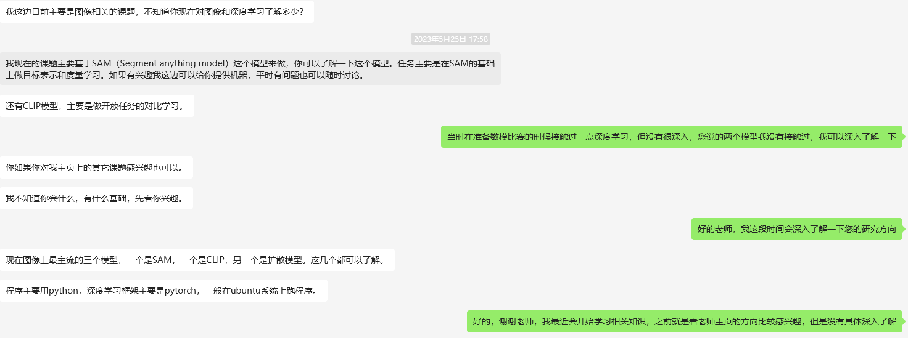

写在前面：观点仅供参考，结合自己在本科阶段的科研经历编写的故事，出现人物皆是虚构，聊天截图都是角色扮演，具有时效性的东西均已过期，请不要对号入座

# 个人经历

正经科研一段

不正经科研多段

夏令营之前投出去一篇CCF-B类会议论文，预推免时论文已被接受

## 正经中的不正经

其实唯一成功的一次是和学长的合作，然后指导老师联系的是信安系副主任

主任人很好，人很和善，学术讨论时不会感到局促

在这之后其实也和主任实验室那边建立起了一定的联系，包括后续发论文、老师推荐之类的都得到过主任的帮助，打心底里非常感谢主任！

其实搞科研想要*快速出成果*捷径确实是找**已经入门科研的学长学姐**合作，前提是*靠谱的学长学姐*；在机缘巧合之下，我结识了Z学长，然后和他合作接触科研，最终做出了一些成果

以上方法仅适用于*急需成果的情况*，即已经邻近保研周期，处于大三上下的关键时期

想要扎扎实实的做科研的话还是需要自己联系好老师进组学习，然后一般老师对于本科生不会很尽心尽力地指导（除非你选择跟着老师深造），要出成果还是需要自己push自己

## 不正经中的正经

### 一周目

本人大二的时候就接触过做可视化的大数据系主任，但是当时我没跟着他，当然后来同学、舍友也有跟着他做事的，一般来说工程项目会比较多，交叉项目结合着发期刊论文也有，~~方向不算特别热门但是后来我翻翻浙大CAD好像也有在做（，如果肯下功夫是能学到东西的~~，比较锻炼工程能力

### 二周目

还久仰一位分到电子信息学院曾经教数据库~~据说今年最后一届数据库~~的教授大名，搞群智感知的，在他手底下好像真能做出成果但是不太清楚那边的培养模式，~~好像在20级还有代理人来着，跟着代理人做的也多~~，老师挺受欢迎的，但是后面去他那的人太多了，老师也忙不过来，于是没去投简历过

### 三周目

在22年的时候好像入职了一批哈工大做NLP的老师，~~应该都是赛尔实验室的吧~~，其中一个特聘好像是[车万翔老师](https://baike.baidu.com/item/%E8%BD%A6%E4%B8%87%E7%BF%94/19314082)的大弟子，当时给一大群21级的发了qq申请

本人本来打算顺藤摸瓜，看能不能跟着科研实习，结果令我直接破防

另一位老师我之前也和他联系过，给我的答复怪怪的，于是作罢，但是据说还不错

### 四周目

教机器学习的老师，他上课非常有意思，科研能力也强；没找他做过科研，但是当时找他填推荐信他非常乐意，人笑眯眯的，对本科生挺好的

### 五周目

好友本科在做医学影像处理的教数字图像处理的教授那里做事，他那里人也不少，肯干应该能投论文，他投的论文好像中了，还不止一篇

### 六周目

一个做大模型安全、人工智能安全的老师手底下好像有几个学生跑路了，但是他带的本科生依然有投了一篇CCF-C会议的

### 空穴来风

据说院长那边生信做的很好，刚拿了杰青的帽子

中南曾经的计算机院士在中南的联系人好像能力挺强，但是网上评价比较分化；中南在清华那边还是有connection的，头两年有一个老师跳到那边去了，应该还是和院士有点关系的，同级的也有在那个实验室做RA的

### 青椒

本人还联系过一个最近转LLM，之前做CV的老师，姓氏比较小众，虽然目前仍然是讲师，但是我相信他未来可期

~~这老师还挺好，但是当时他邦一堆东西全丢给我，手足无措又只能给他鸽了，非常抱歉~~

后面听说他目前应该和四周目老师是一个组

三周目老师应该都是青椒，第二个老师是我唯二联系的讲师，未来可期

还有一个23年刚入职的特聘副教授，名字很好听，能力很强，做安全和联邦学习的，前途是光明的

## 写在最后

还可以尝试一下外校的，包括西湖大学之类的，有正经的学校官方招的暑期学校生和实验室自己招的RA，出成绩需要比较长的时间，本人当时尝试联系过WLU冉冉升起的NLP之星，本人应该是非常厉害的，可惜本人太菜了被博士生看不起后续作罢了
