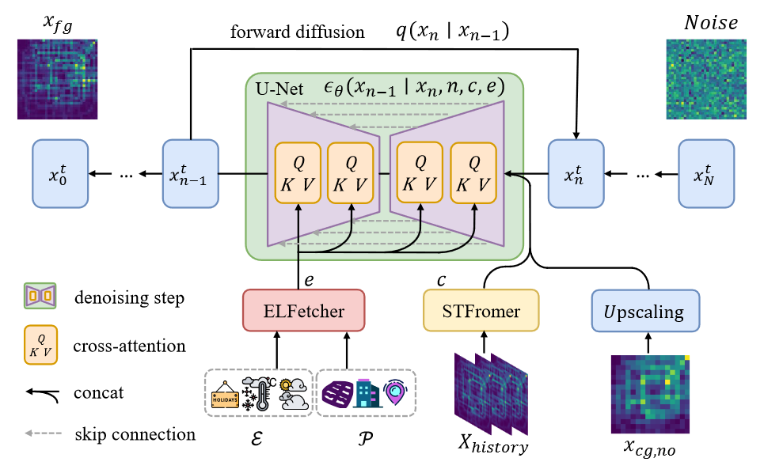
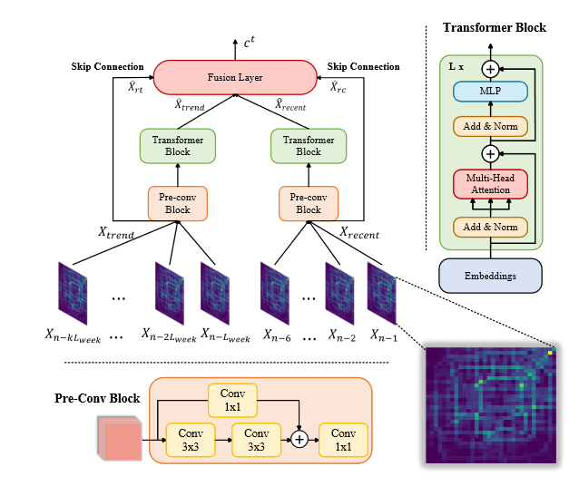



三个主要的模块

1. 条件去噪扩散概率模型
2. 时空特征提取网络
3. 语义特征提取网络

## 条件去噪扩散概率模型

一种以U-Net为骨干的条件DDPM作为细粒度城市流推断的生成方法

### U-Net

U-Net模型由一个编码器（下采样部分）和一个解码器（上采样部分）组成，中间通过跳跃连接（skip connections）将编码器的特征图与解码器对应层的特征图连接起来

因为处理的是时间序列，首先对时间序列进行嵌入编码

因为是先下采样中间层然后上采样

下采样采用大的带自注意力的残差块

编码器和解码器是对称的

UNet还是比较容易理解的

UNet实际上做的是一个风格上的迁移，他的输入和输出实际上尺寸相当

这里Unet实际上学习的是中间从 `n`到 `n-1`这一步的去噪处理

### DDPM

DDPM实际上是一个正向加噪，反向去噪的过程，我们要增强模型的鲁棒性，也就是说减小噪声、数据缺失这些场景对模型的干扰

由于有一个加噪的过程，所以对于有噪声的数据集的干扰就会减小

我们的任务是通过DDPM这个过程去训练一个反向去噪的UNet，能够从噪声细粒度数据中去噪获得准确的细粒度数据

## 时空特征提取网络

将时空数据划分成了两块，分别提取长期趋势和短期特点

这里面的时空数据是细粒度的

首先通过卷积的预处理，然后分别采用短期vit和长期vit进行特征提取

中间有一个跳跃连接把原始数据聚合拼接
