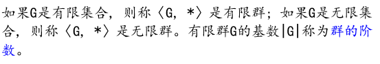
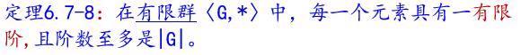
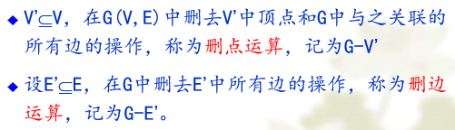
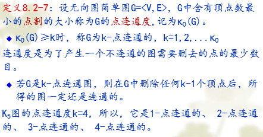
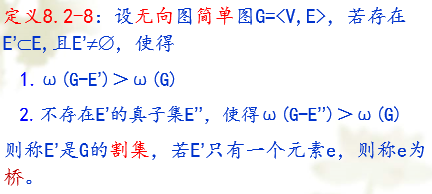
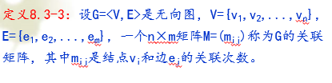

# 离散数学

## 数理逻辑

### 命题

#### 概念

有真假判断的陈述语句

命题的真值：真（T或1）、假（F或0）

举例：

* 今天下雪
* The only positive integers that divide 23 are 1 and itself
* 5+4==28
* 星期二有离散数学课
* I wish I were a gold medal holder
* 你贵姓？

**真值指派**

表示确定命题的标识符成为命题常量；

仅仅表示命题的的位置标志的标识符称为命题变元

给定命题变元的取值，叫做一个真值指派

#### 命题联结词

若一个命题不能分解为更简单的命题，则称为原子命题

包含两个和两个以上命题的句子叫做复合命题；

复合命题通过简单命题和联结词表达出来

常用的命题联结词

**否定**

$\lnot P$

| P | $\lnot P$ |
| :-: | :---------: |
| T |      F      |
| F |      T      |

**合取**

$P \land Q$

| P | Q | $P \land Q$ |
| - | - | ------------- |
| T | T | T             |
| T | F | F             |
| F | T | F             |
| F | F | F             |

**析取**

$P \lor Q$

| P | Q | $P \lor Q$ |
| - | - | ------------ |
| T | T | T            |
| T | F | T            |
| F | T | T            |
| F | F | F            |

**条件（蕴含）**

当且仅当P为T，Q为F时，P$\to$Q为F

$P \to Q$

| P | Q | $P \to Q$ |
| - | - | ----------- |
| T | T | T           |
| T | F | F           |
| F | T | T           |
| F | F | T           |

**双条件（等值）**

当且仅当P、Q的真值相同时，P$\leftrightarrow$Q为T，否则P$\leftrightarrow$Q为F.

| P | Q | $P \leftrightarrow Q$ | $(P \to Q) \land (Q \to P)$ |
| - | - | ----------------------- | ----------------------------- |
| T | T | T                       | T                             |
| T | F | F                       | F                             |
| F | T | F                       | F                             |
| F | F | T                       | T                             |

条件联结词是不独立的

#### 命题变元和命题公式

单个命题变元和命题常元叫做原子公式；

直观地，由命题变元、命题常量、命题联结词、括号组成的一个有意义的式子为命题公式（也叫合式公式）

完整的命题公式定义

逻辑等价

命题公式的赋值和命题公式的分类：重言式、矛盾式、可满足式、偶然式。

两个命题公式，如果对所有的真值指派都有相同的真值，则称它们是逻辑等价的命题。

### 重言式

#### 概念

在任何真值指派下均取真的命题公式称为永真式或重言式；

在任何真值指派下均取假的命题公式称为永假式或矛盾式；

至少有一种真值指派使其为真的命题公式称为可满足式。

至少有一种指派使其为真，同时至少有一种指派使其为假的命题公式称为中性式或偶然式。

总结来说一个命题公式，不是可满足式就是永假式

#### 恒等式

逻辑等价的符号$\iff$

逻辑等价不是逻辑联结词，表示两个命题公式的一种关系

联系

$A \iff B$，当且仅当$A \leftrightarrow B$是永真式

逻辑恒等式

* 双否律
  $\lnot(\lnot P) \iff P$
* 幂等律

  $$
  P \lor P \iff P
  $$

  $$
  P \land P \iff P
  $$
* 交换律

  $$
  P \lor Q \iff Q \lor P
  $$

  $$
  P \land Q \iff Q \land P
  $$
* 结合律

  $$
  (P \lor Q) \lor R \iff P \lor(Q \lor R)
  $$

  $$
  (P \land Q) \land R \iff P \land (Q \land R)
  $$
* 分配律

  $$
  {P}\land({Q}\lor{R})\Leftrightarrow({P}\land{Q})\lor({P}\land{R})
  $$

  $$
  P \vee (Q\wedge R)\Leftrightarrow(P\vee Q)\wedge(P\vee R)
  $$
* 德摩根律

  $$
  \sim({P}\wedge{Q})\Leftrightarrow\sim{P}\vee\sim{Q}\\\sim({P}\vee{Q})\Leftrightarrow\sim{P}\wedge\sim{Q}
  $$
* 蕴含表达式

  $$
  {P}\to{Q}\Leftrightarrow\sim{P}\vee{Q}
  $$
* 零一律

  $$
  \begin{array}{c}\mathsf{P}\lor\mathsf{T}\Leftrightarrow\mathsf{T}\\\mathsf{P}\land\mathsf{F}\Leftrightarrow\mathsf{F}\end{array}
  $$
* 同一律

  $$
  \begin{array}{c}\mathsf{P}\lor\mathsf{F}\Leftrightarrow\mathsf{P}\\\mathsf{P}\land\mathsf{T}\Leftrightarrow\mathsf{P}\end{array}
  $$
* 排中律

  $$
  {P}\vee\sim{P}={T}
  $$
* 输出律

  $$
  {P}\land{Q}\to{R}\Leftrightarrow{P}\to({Q}\to{R})
  $$
* 归谬律

  $$
  (({P}\to{Q})\land({P}\to\sim{Q}))\Leftrightarrow\sim{P}
  $$
* 逆反律

  $$
  ({P}\to{Q})\Leftrightarrow(\sim{Q}\to\sim{P})
  $$
* $\lnot(\lnot P) \iff P$
* 

#### 永真蕴含式

如果$A \to B$为永真式，则称A蕴含B，记为$A \Rightarrow B$

$$
\begin{aligned}
&P\Rightarrow(P \vee Q) \\
&({P}\wedge{Q})\Rightarrow{P} \\
&({P}\land({P}\rightarrow{Q}))\Rightarrow{Q} \\
&((\mathsf{P}\to\mathsf{Q})\land\lnot\mathsf{Q})\Rightarrow(\lnot\mathsf{P}) \\
&(\lnot{P}\land({P}\lor{Q}))\Rightarrow{Q} \\
&(({P}\to{Q})\land({Q}\to{R}))\Rightarrow({P}\to{R}) \\
&({P}\to{Q})\Rightarrow(({Q}\to{R})\to({P}\to{R})) \\
&(({P}\to{Q})\land({R}\to{S}))\Rightarrow({P}\land{R}\to{Q}\land{S}) \\
&((\mathsf{P}\leftrightarrow\mathsf{Q})\wedge(\mathsf{Q}\leftrightarrow\mathsf{R}))\Rightarrow(\mathsf{P}\leftrightarrow\mathsf{R})
\end{aligned}
$$

#### 恒等式和永真蕴含式的两个性质

1. 若$A \Leftrightarrow B,B \Leftrightarrow C$，则$A \Leftrightarrow C$；若$A \Rightarrow B,B \Rightarrow C$，则$A \Rightarrow C$
   逻辑恒等和永真蕴含都是传递的
2. 若$A \Rightarrow B,A \Rightarrow C$，则$A \Rightarrow B \land C$

#### 代入规则和替换规则

**代入规则**

重言式（矛盾式）的每一代入实例都是重言式（矛盾式）

代入规则针对的是永真式或永假式中的命题元素，此命题元素本身也可以是命题公式

**置换规则**

设X是命题公式A的子公式，如果$X \Leftrightarrow Y$，则将A中的X用Y置换所得到的命题公式B与A等价。

等值演算

验证命题公式等值常用的方法有：真值表法、蕴含法、公式法（直接证法）等。

#### 对偶原理

设有公式A，其中仅有联结词$\lor,\land,\lnot$，在A中将$\land,\lor,T,F$分别换成$\lor,\land,F,T$，得到公式$A^*$，称$A^*$为A的对偶公式

$$
\neg{A}({P}_1,{P}_2,\ldots,{P}_n)\Leftrightarrow{A}^*(\neg{P}_1,\neg{P}_2,\ldots,\neg{P}_n)
$$

### 范式

将合取称为积，将析取称为和

命题公式中的命题变元和命题变元的否定之积/和，称为基本积/和

#### 析取范式和合取范式

一个命题公式称为析取范式，如果它具有如下形式：$A_1 \lor A_2 \lor ...A_n$，其中A1,A2,…，An都是由命题变元或其否定所组成的合取式。简言之，析取范式由基本积Ai之和组成。

一个命题公式称为合取范式，如果它具有如下形式：A1∧A2 ∧…∧An，其中A1， A2，…，An都是由命题变元或其否定所组成的析取式。简言之，合取范式由基本和Ai之积组成。

求范式的步骤

1. 化归：将命题公式中的联结词化归为$\lnot,\land,\lor$
2. 移非：用德·摩根律，将求非符号移到命题变元的前面
3. 归约：利用分配律将之化为析取或合取范式

#### 主析取范式和主合取范式

主析取范式

n个命题变元的合取式，称为布尔小项或极小项，如果每个命题变元或其否定不能同时出现，但二者必须出现且仅出现一个。

极小项

1. 每个极小项当其真值指派与编码相同时，其真值为1，在其余$2^{n-1}$中指派情况下均为0
2. 任意两个不同的极小项合取式为0
3. 全体极小项的析取式为1

**极小项**举例

极小项是一种*简单合取式，**成真赋值***

凡是0赋值的 , 带$\lnot$符号 ; 凡是1赋值的 , 对应正常命题变项

两个命题变元的极小项

|           公式           | 成真赋值 |  名称  |
| :-----------------------: | :------: | :-----: |
| $\lnot p \land \lnot q$ |    00    | $m_0$ |
|    $\lnot p \land q$    |    01    | $m_1$ |
|    $p \land \lnot q$    |    10    | $m_2$ |
|      $ p \land q$      |    11    | $m_3$ |

对于给定的命题公式，如果有一个等价公式，它仅由极小项的析取所组成，则该等价式称为原式的主析取范式

在真值表中，一个公式的真值为T的指派所对应的极小项的析取，即为此公式的主析取范式

主析取范式的求法

1. 真值表法
2. 公式法
   基本步骤：
   1. 化归为析取范式
   2. 合并同类同类项，去掉永假项
   3. 对合取项补入没有出现的命题变元，即添加$P \lor \lnot P$项，然后利用分配律展开公式

主合取范式

n个命题变元的析取式，称为布尔大项或极大项，如果每个命题变元或其否定不能同时出现，但二者必须出现且仅出现一个。

极大项的常见性质：

1. 每个极大项当其真值指派与编码相同时，其真值为0，在其余$2^{n-1}$中指派情况下均为1。
2. 任意两个不同的极大项析取式为1。
3. 全体极大项的合取式为0。

极大项举例

公式是简单析取式，成假赋值

凡是1赋值的 , 带$\lnot$符号 ; 凡是0赋值的 , 对应 正常 命题变项 ;

|           公式           | 成假赋值 |  名称  |
| :----------------------: | :------: | :-----: |
|       $p \lor q$       |    00    | $M_0$ |
|    $p \lor \lnot q$    |    01    | $M_1$ |
|    $\lnot p \lor q$    |    10    | $M_2$ |
| $\lnot p \lor \lnot q$ |    11    | $M_3$ |

命题公式，若有一个等价公式，它仅有极大项的合取所组成，则该等价式称为原式的主合取范式。

在真值表中，一个公式的真值为F的指派所对应的极大项的合取，即为此公式的主合取范式

求一个命题公式的主和取范式的方法，也有真值表法与公式法

1. 化归为合取范式；
2. 合并同类项，去掉永真项；
3. 对析取项补入没有出现的命题变元，即添加$P \land \lnot P$项，然后利用分配律展开公式。

* 极大项和极小项之间的关系$m_i \Leftrightarrow \lnot M_i$

主析（合）取范式的求法举例：

分别有真值表法和等值转换法

求解$(p \to q) \land (q \to r)$的主析取范式和主合取范式

**真值表法**

命题结果真，对应极小项求和为主析取范式

命题结果假，对应极大项求积为主合取范式

| 序号 | p | q | r | $(p \to q) \land (q \to r)$ |
| :--: | :-: | - | - | :---------------------------: |
|  0  | 0 | 0 | 0 |               1               |
|  1  | 0 | 0 | 1 |               1               |
|  2  | 0 | 1 | 0 |               0               |
|  3  | 0 | 1 | 1 |               1               |
|  4  | 1 | 0 | 0 |               0               |
|  5  | 1 | 0 | 1 |               0               |
|  6  | 1 | 1 | 0 |               0               |
|  7  | 1 | 1 | 1 |               1               |

成真赋值0，1，3，7

主析取范式$m_0+m_1+m_3+m_7$

成假赋值2，4，5，6

主合取范式$M_2 \cdot M_4 \cdot M_5 \cdot M_6$

**等值演算法**

$\iff (\lnot p \lor q) \land (\lnot q \lor r) \iff ((\lnot r \land r) \lor (\lnot p \lor q)) \land ((\lnot p \land p) \lor (\lnot q \lor r)) \iff (\lnot p \lor q \lor \lnot r) \land (\lnot p \lor q \lor r) \land (\lnot p \lor \lnot q \lor r) \land (p \lor \lnot q \lor r)$

得到主合取范式

$M_2 \cdot M_4 \cdot M_5 \cdot M_6$

主合取范式和主析取范式是互补的

#### 主析取范式的个数

对于任意确定的命题公式而言，主析取范式是唯一的；

对于有n个命题变元的命题公式，所有可能公式的主析取范式的数量是确定的；

有n个命题变元的命题公式，总的主析取范式的个数是$2^{2^n}$。

### 联结词的扩充与归约

#### 联结词的扩充

#### 联结词的归约

一个联结词集合，用其中联结词构成的式子足以把一切命题公式等价地表达出来，则这个联结词集合称为全功能的。

$\{\lnot,\land,\lor\}$是全功能的

#### 其他主范式

### 推理规则和证明方法

#### 推理规则

设A,C是两个命题公式，如$A \to C$为一重言式，即$A \Rightarrow C$，则称C是A的有效结论，或C可以由A逻辑推出

推理大方法有二

1. 基于定义的推理
2. 基于规则的推理

细化

1. 真值表法
2. 等值演算法
3. 主范式法
4. 分析法

常用的推理规则

* 假言推理
* 析取三段论
* P规则（前提引入规则）
* T规则（结论引入规则）
* CP规则

  
* 代入规则
* 置换规则

引入前提，规定前提假设是真的

#### 证明方法

自然推理系统

从给定的前提出发，运用上述推理的有效式，即根据推理规则进行的推理。

自然推理和公理化推理不同，自然推理不预设公理，只是根据规则，从给定的前提出发得出结论

直接证法

间接证法

逆反证明法

反证法

### 谓词和量词

#### 概念

命题逻辑的局限性

无法表达原子命题之间所具有的共同特点

不能反映命题的内部结构、成分和命题之间的内在联系。即不能将命题分解开

一个谓词（如A）和n个有次序的客体(如a1,a2,…,an)表示成A(a1,a2,…,an), 称它为该原子命题的谓词形式或命题的谓词形式。

一个n元谓词不是一个命题，但将n元谓词中的客体变元都用具体的客体取代后，就成为一个命题

#### 命题函数与量词

单独一个谓词不是命题，只有当这个谓词后面紧跟具体客体后才是命题

在命题中表示客体数量的词，称之为量词

有全称量词$\forall$，存在量词$\exist$

1. 对于全称量词 ($\forall x$)，刻划其对应个体域的特性谓词作为条件式之前件加入；
2. 对于存在量词($\exist x$) ，刻划其对应个体域的特性谓词作为合取式之合取项加入。

#### 量化断言和命题的关系

量词展开式

$$
(\forall x) A(x) \iff A(a_1) \land A(a_2) \land A(a_3) \land \dots A(a_n)
$$

$$
(\exist x)B(x) \iff B(b_1) \lor B(b_2) \lor B(b_3) \lor \dots B(b_n)
$$

#### 谓词公式及命题符号化

谓词相关符号

1. 联结词
2. 量词
3. 括号、逗号
4. 客体常量符号
5. 客体变量符号
6. 谓词符号
7. 客体函数符号

举例

任何人如果身体不好，则学习和工作都不好

小王比他的父亲高

客体函数刻划了客体与客体之间的关系，不单独使用，要嵌入在谓词中

客体函数与谓词的区别

客体函数中的客体变元用客体带入后的结果依然是客体

谓词中的个体变元用确定的个体带入后就变成了命题，其真值为T或者为F

#### 谓词公式

原子公式就是n元谓词，不出现命题联结词和量词

原子谓词公式是合式公式

如果A、B是合式公式，则使用联结词联结得到的命题都是合式公式

#### 自由变元与约束变元

紧接在量词后面的谓词公式，即量词的作用范围称之为量词的作用域或辖域

1. 若量词后有括号，则括号内的公式为该量词的辖域
2. 若量词后无括号，则与量词邻接的公式为该量词的辖域
3. 若多个量词紧挨着出现，则后边的量词及其辖域就是前边量词的辖域

在量词的辖域内，且在量词后面出现的变元，称这样的变元为约束出现

不受量词约束的变元，称这样的变元为自由出现

### 谓词演算的永真公式

#### 基本定义

A与B在个体域E上是等价的

给定谓词公式A、B，E是它们的共同个体域，如果不论对公式A、B作任何赋值，都使得A与B的真值相同(或者说$A \leftrightarrow B$是重言式)，则称公式A与B在个体域E上是等价的。

A与B等价

如果不论对什么个体域E，都使得公式A与B等价，则称A与B等价，记作$A \iff B$

A为不可满足的

一个谓词公式A，如果在所有赋值下都为假，则称A为不可满足的

A是可满足的

一个谓词公式A，如果至少在一种赋值下为真，则称A是可满足的

A在个体域E上是永真的（有效的）

给定的任何谓词公式A，E是其个体域，如果不论对公式A作任何赋值，都使得A的真值为真，则称公式A在个体域E上是永真的（有效的）

在个体域E上公式A蕴含B

给定谓词公式A、B，E是它们的个体域，如果不论对公式A、B作任何赋值，都使得$A \to B$为重言式，则称在个体域E上公式A蕴含B

公式A蕴含B

如果不论对什么个体域E，都使得公式$A \to B$为重言式，则称A蕴含B，记作$A \Rightarrow B$

讨论重要的谓词等价公式和重言蕴含式

1. 由命题公式推广出的公式
2. 消去量词等值式
3. 量词否定等值式
4. 量词辖域收缩与扩张等值式
5. 量词分配等值式

由命题公式推广出的公式

* $$
  (\exists x)(A(x)\to B(x))\Leftrightarrow(\exists x)(\lnot A(x)\lor B(x))
  $$
* $$
  \neg((\exists x)A(x)\wedge(\exists x)B(x))\Leftrightarrow\neg(\exists x)A(x)\vee\neg(\exists x)B(x)
  $$
* $$
  A(x)\Rightarrow A(x) \lor B(x)
  $$

量词否定公式

$$
\neg(\forall\mathrm{x})\mathrm{A}(\mathrm{x})\Leftrightarrow(\exists\mathrm{x})\neg\mathrm{A}(\mathrm{x})\\\neg(\exists\mathrm{x})\mathrm{A}(\mathrm{x})\Leftrightarrow(\forall\mathrm{x})\neg\mathrm{A}(\mathrm{x})
$$

量词分配公式

$$
(\exists\mathrm{x})(\mathrm{A}(\mathrm{x})\lor\mathrm{B}(\mathrm{x}))\Leftrightarrow(\exists\mathrm{x})\mathrm{A}(\mathrm{x})\lor(\exists\mathrm{x})\mathrm{B}(\mathrm{x})\\(\forall\mathrm{x})(\mathrm{A}(\mathrm{x})\land\mathrm{B}(\mathrm{x}))\Leftrightarrow(\forall\mathrm{x})\mathrm{A}(\mathrm{x})\land(\forall\mathrm{x})\mathrm{B}(\mathrm{x})
$$

存在对析取满足分配律

任意对合取满足分配律

任意对析取/存在对合取不存在分配等价式

$$
(\exists x)(A(x)\land B(x))\Rightarrow(\exists x)A(x)\land(\exists x)B(x)\\(\forall x)A(x)\lor(\forall x)B(x)\Rightarrow(\forall x)(A(x)\lor B(x))
$$

含有量词的永真公示表

$$
\begin{aligned}
&\forall\mathrm{xP}\left(\mathrm{x}\right)\Rightarrow\mathrm{P}\left(\mathrm{y}\right) \\
&P(y)\Rightarrow\exists xP(x) \\
&\forall\mathrm{x\neg P(x)\Leftrightarrow\neg\exists xP(x)} \\
&\exists\mathrm{x}\neg\mathrm{P}\left(\mathrm{x}\right)\Leftrightarrow\neg\forall\mathrm{xP}\left(\mathrm{x}\right) \\
&\forall xA(x)\to B\Leftrightarrow\exists x(A(x)\to B) \\
&\exists xA(x)\to B\Leftrightarrow\forall x(A(x)\to B) \\
&\mathrm{A\to\forall xB(x)\Leftrightarrow\forall x(A\to B(x))} \\
&A\to\exists xB(x)\Leftrightarrow\exists x(A\to B(x)) \\
&\exists x\left(A\left(x\right)\to B\left(x\right)\right)\Leftrightarrow\forall xA\left(x\right)\to\exists xB\left(x\right) \\
&\exists xA(x)\to\forall xB(x)\Longrightarrow\forall x(A(x)\to B(x))
\end{aligned}
$$

#### 几条规则

1. 约束变元的换名规则，该变元在量词及该量词的辖域中的所有出现必须一起更改
   任意对合取关系不需换名，对析取关系需要换名
   存在对合取关系需要换名，对析取关系不需换名
2. 对自由变元的代入规则，对整个公式中出现该自由变元的每一处进行更改
3. 替换规则
4. 对偶原理
   在公式A=B或$A \Rightarrow B$中，A,B仅含运算符$\lnot,\lor,\land$，将上式中的全称量词与存在量词互换，$\lor \land$互换，T与F互换，则$A^*=B^*,B^* \Rightarrow A^*$

#### 前束范式

谓词公式只含$\lnot,\lor,\land$

量词都在谓词公式的最前面

### 谓词演算的推理规则

谓词演算中推理的形式结构与之前命题推理的形式结构相同

#### 某公式对某变元是自由的

如果公式A(x)中，x不出现在量词$\forall y$或$\exist y$的辖域之内，则称A(x)对y是自由的

#### 推理规则

命题推理的所有推理规则：P规则，T规则，CP规则

量词相关的规则：

* 全称量词消去规则：US
  US成立的条件，去掉量词时，必须是前束范式

  $$
  (\forall x) A(x) \Rightarrow A(y)
  $$

  $$
  (\forall x)A(x) \Rightarrow A(c)
  $$
* 全称量词引入规则：UG

  $$
  A(c) \Rightarrow (\forall x)A(x)
  $$

  c一定是任意的客体，否则不可全称推广
* 存在量词消去规则：ES

  $$
  (\exist x)A(x) \Rightarrow A(c)
  $$

  c是使A成立的特定客体常量
* 存在量词引入规则：EG

  $$
  A(y) \Rightarrow (\exist x)A(x)
  $$

  $$
  A(c) \Rightarrow (\exist x)A(x)
  $$

  添加量词时，要加在公式的最左边(即新加的量词前也无任何符号)，且其辖域作用到公式的末尾

1. ES、US、EG、UG四条规则都只有在量词的作用域是整个公式的情况下才能使用
2. US、ES和EG、UG的使用
3. 指定为同一变元，先ES(存在指定)再US(全称指定)
4. 多次使用ES规则，使用一次更改一个变元；US无此要求

## 代数

### 总论

#### 幺元和零元

#### 逆元

#### 子代数

#### 同态

#### 同构

* 两个代数在结构上一致，含义是：
* * 元组有相同的构成成分；
  * 运算和常数遵循相同的规则；
  * 代数的载体有相同的基数；
* 这种结构上的一致性叫做“同构”；
* 数学上，意味着两个代数之间双射函数的存在；
* 本质上，双射函数就是同构。
* * （注意：这是不精确的说法，这样说的目的是为了突出关键和重点，这里是讲课，不是写书）

### 群

#### 半群

结合律

#### 独异点

含么半群为独异点

结合律+幺元

#### 子半群

#### 子独异点

#### 可交换半群和独异点

#### 半群同态和独异点同态

#### 群

结合律+幺元+可逆

群的阶和阿贝尔群

#### 阿贝尔群

#### 消去律和唯一等幂元

#### 置换

给定集合A，集合中的元素的一个排列被称为一个置换

定理：群中没有零元

#### 逆元运算

低阶群穷举

一阶群1个

二阶群1个

三阶群1个

四阶群2个

#### 群元素的幂

#### 元素的阶

元素的阶具有周期性

逆元同阶：群中的任一元素和它的逆元具有同样的阶

阶定理

#### 置换群和循环群

置换群

循环群

每个循环群是可交换的

生成元的阶必为群阶

循环群的重要结论

#### 子群和群同态

缩减判定

子群第一判定定理

子群第二判定定理

循环群的子群依然是循环群

n阶循环群，n的因子有几个，子群就有几个

#### 群同态

#### 群同构

满同态和单一同态同时成立，则同构

#### 陪集

表示元素一定在它所确定的陪集内

表示元素相同的左右陪集未必相等

陪集互斥或全等

H的任意陪集的大小是相等的

#### 拉格朗日定理

陪集中的元素构成一个等价关系；因此，陪集是G的集合的一个划分（等价关系类）；

n=km

基于拉格朗日定理的推论

* 任何质数阶的群不可能有非平凡子群

* 一个质数阶的群必定是循环群，并且任一与么元不同的元素都是生成元

陪集元素归属判定

#### 正规子群

简单理解就是左右陪集相等

正规子群的不同陪集都是G的同余类

正规子群的判定群G中阶数唯一的那些子群必是正规子群

#### 商群

只有正规子群的陪集才构成商群

## 图论

### 基本概念

#### 图

表示

文字表示

图像表示

一些基本概念

* 多重图：平行边（重边）、重数；
* 线图：非多重图；
* 简单图：没有环的线图。

赋权图

带权图G是图的边被赋予了一个数值的图

#### 结点次数

**握手定理**

所有结点次数之和等于边数的2倍

任一图中，次数为奇数的结点（即奇结点）的个数必为偶数

有向图中引入次数之和等于引出次数之和，都等于边数

握手定理是一个普适性很强的定理，适用于所有图

正则图

各结点次数均相同的无向图称为正则图，各结点均有相同次数k的图称为k次正则图

#### 图的同构

若两个图同构，必须满足下列条件：

1. 结点个数相同
2. 边数相同
3. 度数相同的结点个数相同

#### 图的运算

对一个或者多个图进行操作从而得到新图就是图运算

1. 图的删点、删边运算

   

   删点、删边后得到的图是原图的子图
2. 图的并运算

   
3. 图的交运算

   
4. 图的差运算

   
5. 图的对称差（环和）运算

   

举例

#### 子图和补图

u所有的顶点和边都属于图G的图称为G的子图。

含有G的所有顶点的子图称为G的生成子图

简单图G=(n,m)生成子图的个数为$2^m$

点导出子图

* 先有点，后有边；
* 边依附于点而来。

边导出子图

* 先有边，后有点；
* 点依附于边而来。

完全图

对于简单图，图中所有结点相互之间都有边相连的图叫做完全图；对于有向图，所有结点相互之间都双向相连。

一个（n,m）图G，其n个结点中每个结点均与其它n-1个结点相邻接，记为$k_n$

无向完全图$m=\frac{1}{2} n (n-1)$

有向完全图$m=n(n-1)$

补图

### 路径和回路

#### 基本概念

* 简单通路：通路中没有重复的边；
* 基本通路：通路中没有重复的点；
* 类似地，简单回路和基本回路。

vi1、vik分别为起点、终点。通路中边的条数称为通路的长度

基本通路一定是简单通路，但反之简单通路不一定是基本通路。

基本回路必是简单回路

在一个具有n个结点的简单图G=<V,E>中，如果经v1有一条简单回路，则经v1有一条长度不超过n的基本回路。

距离

#### 图的连通度

从一个有向图的结点vi到另一个结点vj间，如果存在一条通路，则称vi到vj是可达的

无向图，若它的任何两结点间均是可达的，则称图G是连通图；否则为非连通图。

如果G的子图G’是连通的，且没有包含G’的更大的子图是连通的，则称G’是G的连通分图，简称分图。

按照等价关系，可将图G中的结点进行分类，一个连通的子图即是一个等价类，称为G的一个连通分支

P(G)表示连通分支的个数。

连通图的连通分支只有一个

顶点数、边数和分图个数的关系

点割与割点

* 点割集：是集合，从图G中删去它，图就正好不连通了；
* 割点：一个点，删去它，图就正好不连通了

点割集是若删去它就会使图不连通的顶点的集合，而割点是若删去此点就会使图不连通的单个顶点

点连通度

割集

若删去它们就会使图不连通的边的集合，而割边是若删去此一边就会使图不连通的边，割边也叫作桥。

边连通度

无向简单连通图的性质

* 无向简单连通图G有一割点v，当且仅当存在两个顶点u、w，使u到w的任何路径都经过v
* 无向简单连通图G没有割点当且仅当G的任意两点u、v同在一条基本回路上
* 无向简单连通图G=<V,E>没有割点，当且仅当图中任一点u和任一边(w,v)同在一条基本回路上
* 无向简单连通图G=<V,E>没有割点，当且仅当任何两条边(u,v)、(w,x)同在一条基本回路上

有向图的连通性

#### 赋权图最短路径

迪杰斯特拉算法

#### 欧拉路径和欧拉回路

欧拉回路：

图G的回路，若它通过G中的每条边一次，这样的回路称为欧拉回路；具有欧拉回路的图称为欧拉图。

欧拉路径：

通过图G中每条边一次的通路（非回路）称为欧拉通路或欧拉路径。

判断欧拉路径的定理

无向连通图G中结点vi与vj存在欧拉通路的充要条件是vi与vj的次数均为偶数或奇数，而其他结点次数均为偶数

无向连通图G是欧拉图的充要条件是G的每个结点均具有偶次数

有向欧拉图的判定

一个有向图G是欧拉图当且仅当G是连通的，且所有结点的入度等于出度。

一个有向图G有欧拉通路当且仅当G是连通的，且除了两个结点外，其余结点的引入次数等于引出次数，且这两结点中，一个结点的入度比出度大1，另一个结点的入度比出度多1。

#### 哈密尔顿路径与回路

若图G的一个回路通过G中每个点一次，这样的回路称为哈密尔顿回路，有这种回路的图称为哈密尔顿图或H-图或哈图

* 欧拉回路是简单回路，无重复边；
* 哈图是基本回路，无重复点

关于如何判断哈密尔顿通路与回路，至今尚未找到它的充要条件，只有一些充分条件和必要条件

哈图性质定理

必要条件

分图个数大于删去点的个数说明该图不是哈图

利用这个定理有时可证明一个图不是哈密尔顿图

Petersen图满足必要条件但不是哈图

充分条件

设有向图，|V|≥2，若所有有向边均用无向边代替后，所得无向图中含生成子图Kn,则G存在哈密尔顿通路

n≥3的Kn图都是哈图

### 图的矩阵表示

有向图的邻接矩阵

无向图的邻接矩阵

* 零图的邻接矩阵：A为零矩阵。
* 完全图的邻接矩阵：A除对角线元素为0外，其余元素为1。
* 无向图的邻接矩阵：无向图的邻接矩阵是对称阵。
* 邻接矩阵的概念还可推广到多重图和带权图。

同构的两个图，对应结点间的邻接关系相同

它们的邻接矩阵或者相同或者其中一个通过行、列交换可得到另一个。

有向图的邻接矩阵和次数

无向图的邻接矩阵和次数

$A_n =A·A···A$的元素的意义

可达性矩阵

关联矩阵

有向图

* 每列和为0；
* 每行绝对值和为deg(v)；
* 其中1个个数是出度，-1的个数是入度；
* 握手定理：矩阵1和-1个数相等；
* 平行边：相同两列。

无向图

* 每列和为2；
* 每行和为deg(v)；
* 握手定理：矩阵所有元素相加等于列数的两倍；
* 平行边：相同两列。

### 图的支配集、独立集和覆盖

#### 支配集、独立集和覆盖

极小支配集、最小支配集

若支配集V’的任何真子集都不是支配集，则称V’是极小支配集；

顶点数最少的支配集称为最小支配集；

最小支配集中的顶点数称为支配数，记作γ0(G)或简记为γ0

点独立集

若在V’中加入任何顶点都不再是独立集，则称V’为极大点独立集；

顶点数最多的点独立集称为最大点独立集；

最大点独立集的顶点数称为点独立数，记作β0(G)，简记为β0

覆盖与点覆盖集

如果点覆盖V’的任何真子集都不是点覆盖，则称V’是极小点覆盖；

顶点个数最少的点覆盖称为最小的点覆盖；

最小点覆盖的顶点数称为点覆盖数，记作α0(G)，简记为α0

三集之间联系

设G(V,E)是无向简单图，G的极大独立集都是G的极小支配集

#### 匹配和边覆盖

若在E’中加入任意一条边所得集合都不是匹配，则称E’为极大匹配。

边数最多的匹配称为最大匹配；

最大匹配的边数称为边独立数或匹配数，记为β1(G)，简记为β1

完美匹配

对于一个图G与给定的一个匹配M，如果图G中不存在M的未覆盖点（非饱和点），则称匹配M为图G的完美匹配。

边覆盖集

若边覆盖E’的任何真子集都不是边覆盖，则称E’是极小边覆盖；边数最少的边覆盖集称为最小的边覆盖；

最小的边覆盖所含的边数称为边覆盖数，记为α1(G)或简记为α1

最小覆盖与最大匹配的转换

* 用最大匹配通过增加关联非饱和点的边获得最小边覆盖；
* 用最小边覆盖通过移去相邻的一条边获得最大匹配。

最大匹配与最小边覆盖的关系

可增广路径

一条边在匹配内一条不在的路径叫交替链(交错路径)，两端均为非饱和点的交替链叫可增广路径

在图上给出一个最大点独立集和一个最大匹配，从而求出β0，β1，α0，α1

### 树

#### 无向树

连通而无简单回路的无向图称为无向树，简称树。

在树中次数为1的结点称为叶，次数大于1的结点称为分支结点或内部节点。

定理

在（n,m）树中，当且仅当

* 连通且m=n-1
* 无简单回路，但增加任一条新边，得到且仅得到一条基本回路
* 连通，但删去任一边便不连通（n≥2）。
* 每对结点间只有一条基本路径（n≥2）。

具有两个结点以上的树至少有两片叶

#### 生成树

#### 最小生成树

定义：连通边带权图G中总权值最小的生成树叫做最小生成树或最小代价树。

设G是边权都不相同的连通简单图，C是一条简单回路，则C上权最大的边e必定不在G的最小生成树中。

kruskal算法：边拓展，在所有边中寻找最小的拓展

prim算法：点拓展，在当前点集中拓展最小的边

### 有向树

#### 有向树的定义和性质

父亲；儿子

祖先；后裔

子树

叶子

内部结点（分枝点）

路径长度（层次）

高度

n元树

#### 前缀码和最优树

#### 搜索树和决策树

搜索

遍历

前序、中序、后序

逆波兰式 后序输出
